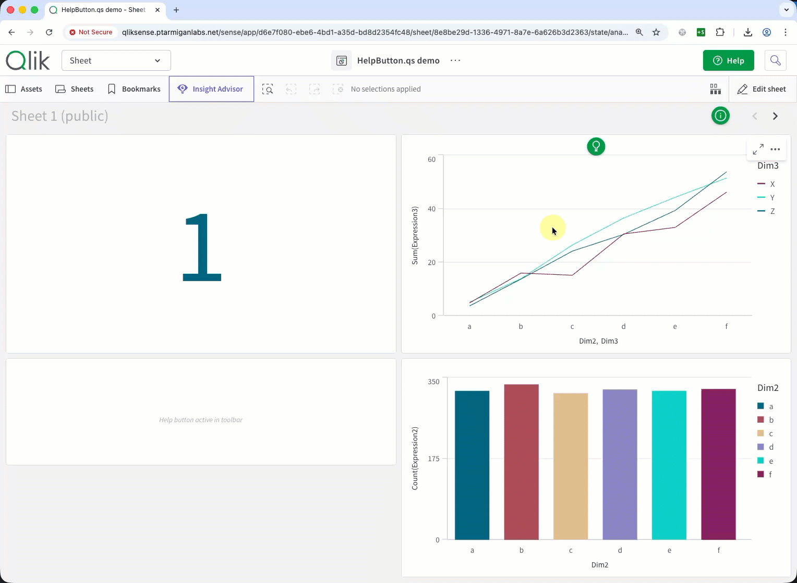
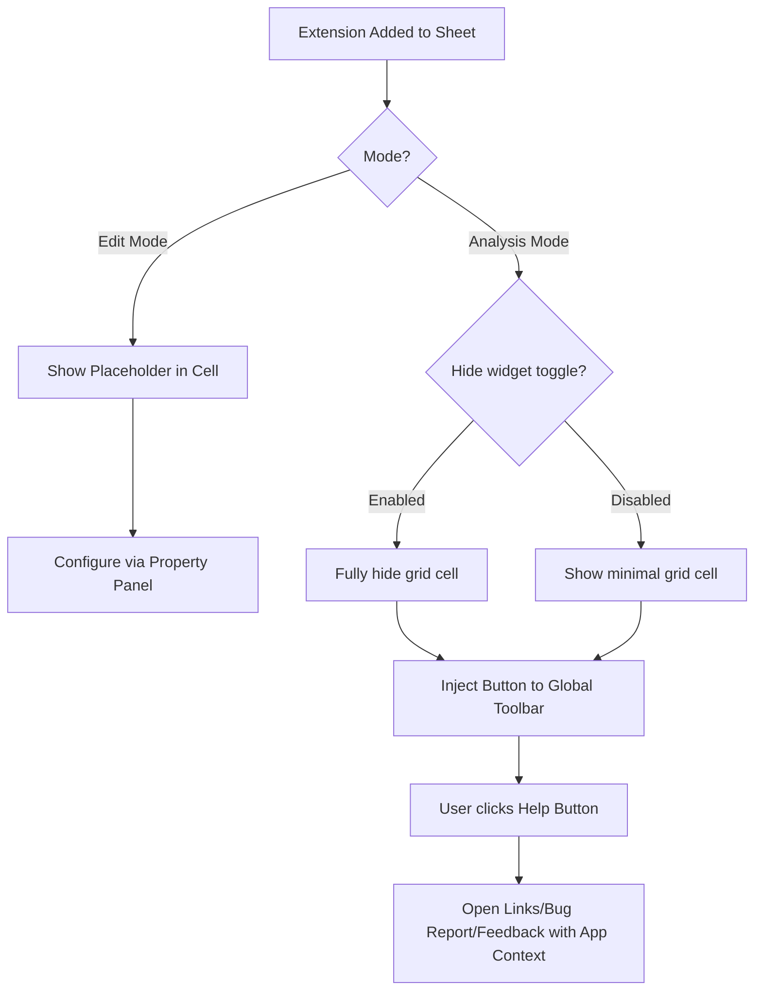
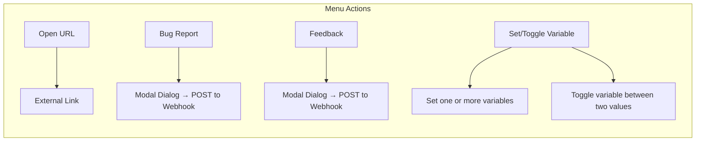
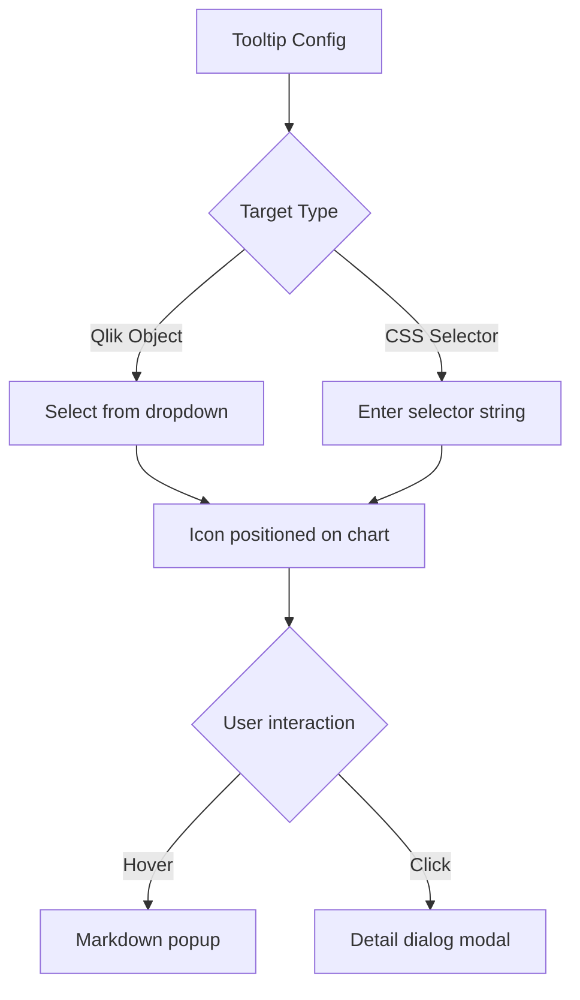

# HelpButton.qs

**helpbutton.qs** is a Qlik Sense extension that injects a configurable help button directly into the Qlik Sense application's toolbar. It provides a seamless way for end-users to access documentation, support resources, or bug reporting forms without cluttering the app sheet area.

## Documentation

Documentation is now split into two folders under `docs/`:

- `docs/app-developer/` for configuring and using the extension in Qlik Sense apps
- `docs/extension-developer/` for implementation details, maintenance, and release workflows

### App developer docs

| Document                                                                                                       | What it covers                                                                                                                  |
| -------------------------------------------------------------------------------------------------------------- | ------------------------------------------------------------------------------------------------------------------------------- |
| [Property Panel Reference](./docs/app-developer/property-panel-reference.md)                                   | Complete property-panel field inventory for the extension, including defaults, conditional settings, and stored property paths. |
| [Menu Items - App Developer Guide](./docs/app-developer/menu-items-app-developer.md)                           | How to configure menu actions, webhooks, variables, visibility rules, and multi-instance behavior.                              |
| [Feedback and Bug Report Authentication](./docs/app-developer/feedback-bug-report-authentication.md)           | Explains None, Authorization header, and Custom headers modes for feedback and bug-report menu items.                           |
| [Tooltips - App Developer Guide](./docs/app-developer/tooltips-app-developer.md)                               | How to target objects or selectors, write Markdown content, tune styling, and work within tooltip limits.                       |
| [Client-Managed vs Cloud - App Developer Guide](./docs/app-developer/client-managed-vs-cloud-app-developer.md) | Platform differences that affect links, payload fields, selectors, and other runtime behavior.                                  |
| [Language and Translations Reference](./docs/app-developer/language-and-translations.md)                       | Locale selection, string override precedence, forced-language settings, and stored translation properties.                      |
| [Template Fields](./docs/app-developer/template-fields.md)                                                     | Dynamic URL and webhook placeholders, platform-specific values, fallback behavior, and debugging tips.                          |
| [Multi-Language Support](./docs/app-developer/multi-language.md)                                               | Background guide to locale detection, fallback order, forced-language behavior, and multilingual configuration patterns.        |

Extension developers and maintainers can find the implementation, security, and release material in [`docs/extension-developer/`](./docs/extension-developer/).

## ❤️ Support the project

If you find this project helpful and use it in your Qlik Sense environment, please consider supporting it financially! Your sponsorship helps ensure the project's long-term sustainability and allows me to continue maintaining it, fixing bugs, and adding new features.

**👉 [Sponsor the project on GitHub](https://github.com/sponsors/ptarmiganlabs)** - Click the "Sponsor" button at the repository page to become a sponsor.

- ⭐ **Star the repository** on GitHub - it helps others discover the project
- 🍴 **Fork and contribute** - pull requests are welcome!
- 💬 **Share your feedback** - let me know how you're using it
- 🐛 **Report issues** - help improve stability and functionality

_This project is maintained by [Göran Sander](https://github.com/mountaindude) and supported by [Ptarmigan Labs](https://ptarmiganlabs.com)._

---

The bug report and feedback features look like this in action:



> Archived HTML injection variants remain available for existing deployments and migration reference in [legacy/variants/basic/README.md](./legacy/variants/basic/README.md) and [legacy/variants/bug-report/README.md](./legacy/variants/bug-report/README.md). New deployments should use the extension documented below.

## Features

- **Global Toolbar Integration**: In analysis mode, the extension attaches a help button to the main Qlik Sense native toolbar, rather than rendering inside a grid cell. The button is only shown when at least one menu item is configured.
- **Cross-Platform Support**: Automatically detects and works on both **Qlik Sense SaaS (Cloud)** and **Client-Managed Qlik Sense (Enterprise)** environments, with same features on both platforms.
- **Invisible Footprint**: The extension cell itself can be configured to be invisible to end-users on the sheet. You can suppress the default interactive hover menus and context menus, and go even further by enabling **"Hide widget on sheet in analysis mode"** to make the grid cell completely invisible — no visible border, background, or shadow — so the extension leaves zero visual trace on the sheet.
- **Extensive Customization**: Configure colors, icons, languages, and menu actions directly from the Qlik Sense property panel.
- **Theme Presets**: Apply one of four predefined color palettes (Default, The Lean Green Machine, Corporate Blue, Corporate Gold) to instantly style the toolbar button, popup, menu items, and tooltips to your corporate brand.
- **Tooltips**: Attach floating help icons to any chart object or page element. Each icon shows a Markdown hover popup — including **embedded videos** (YouTube, Vimeo, or direct `.mp4`/`.webm`/`.ogg` files) — and optionally opens a detail dialog on click. Fully themeable with per-tooltip color overrides.
- **Context-Aware Links**: Dynamically pass application context (such as App ID, Sheet ID, and user details) to outbound links using template tags.
- **Built-in Translations**: Supports automatic UI translation into multiple languages based on Qlik Sense locale, with full override capabilities via an expandable "Language & Translations" section in the property panel (see [language & translations docs](./docs/app-developer/language-and-translations.md) for details).

## Audience

This extension is designed to be added by **Qlik Sense Administrators and Developers** into their Sense applications. Once added to a sheet, it provides a globally accessible help menu for the end-users of that application.

## How It Works

When you drag and drop the extension onto a sheet:

1. In **Edit Mode**: It displays a placeholder within the grid cell indicating the current active features (e.g. `4 menu items · 2 tooltips · Bug report: On · Feedback: On` where "On" implies at least one active menu item is configured with that corresponding action type). The help button itself also remains visible down in the grid cell, allowing developers to immediately test menu items while configuring them via the standard Qlik Sense Property Panel.
2. In **Analysis Mode**: The extension dynamically removes itself from the sheet's visual flow and injects the actual button into the top application toolbar. If the **"Hide widget on sheet in analysis mode"** toggle is enabled, the grid cell is made completely invisible (no border, background, or shadow) so it leaves zero visual trace on the sheet.



## Toolbar Coexistence with Onboard.qs

HelpButton.qs is designed to work alongside [Onboard.qs](https://github.com/ptarmiganlabs/onboard.qs) when both extensions inject buttons into the Qlik Sense app toolbar.

### Button ordering

When both extensions are present on a sheet:

1. **HelpButton.qs** always occupies the **leftmost** position (inserted as `firstChild` of the toolbar anchor, `#top-bar-right-side`).
2. **Onboard.qs** detects the Help button container (`#hbqs-container`) and positions its "Start Tour" button immediately **after** it.

This ordering is stable regardless of which extension was added to the sheet first.

### Multiple instances on the same sheet

It is valid to place several HelpButton.qs extension objects on the same sheet. Each object registers its config in a shared registry. The toolbar button is rendered from the first registered config. When an object is removed or has no menu items, it unregisters and the button rebuilds from the remaining objects — or is removed entirely if none remain.

## Installation

1. Download the latest compiled extension `.zip` file from the releases page (or build it from source). Unzip that file to get the `helpbutton-qs.zip` package, which is the actual extension to be imported into Qlik Sense.
2. **Qlik Sense SaaS**: Upload the extension in the Management Console under **Extensions**.
3. **Qlik Sense Client-Managed**: Import the zip file via the Qlik Management Console (QMC) under the **Extensions** section.

For app-developer guidance on using the extension across both platforms, see [Qlik Sense Client-Managed vs Qlik Cloud — Sense App Developer Guide](./docs/app-developer/client-managed-vs-cloud-app-developer.md).

## Usage

1. Open your Qlik Sense application in Edit Mode.
2. Drag the **HelpButton.qs** extension from the **.qs Library** bundle inside the Custom Objects panel onto your sheet.
3. Configure the appearance, links, and behavior in the Property Panel on the right.
4. Switch to Analysis Mode to see the button appear in the top toolbar.

> **💡 Note on Qlik Sense Expressions:** Almost all string properties in the property panel support Qlik Sense expressions (using the **fx** button or prefixing with `=`). This allows you to dynamically configure text, titles, labels, URLs, timestamp formats, and conditions based on sheet state, data selections, or the current user.

## Menu Item Types

When configuring the **Menu Items** in the Property Panel, you can add multiple options that map to different actions. Each menu item can be conditionally shown or hidden based on a Qlik expression using the optional **Show Condition** property. Right-click any menu item in the property panel to **Duplicate** it — this copies all of its settings into a new item, making it easy to create similar entries with only minor differences. The help button supports four types of menu actions:

1. **Open URL (`link`)**:
   - Opens a specified URL (can be configured to open in a new tab or the same window).
   - Useful for pointing users to external documentation, intranet pages, wikis, or company portals.
   - Supports [template fields](./docs/app-developer/template-fields.md) in the URL (e.g. `https://help.example.com/sys/{{appId}}`), allowing for context-sensitive deep links that adapt to the user's current app or sheet.
2. **Bug Report Dialog (`bugReport`)**:
   - Opens an interactive modal directly inside Qlik Sense where users can write a detailed text description of an issue.
   - Optional **severity picker** (Low / Medium / High) can be shown or hidden via the property panel.
   - Configurable **max description length** (default 1 000 characters), with a live remaining-characters counter in the dialog.
   - Automatically bundles the user's environment metadata into a JSON payload and POSTs it to a configured webhook endpoint via a background request.

- Supports three authentication strategies: `None`, `Authorization header` (Bearer token), and `Custom headers`.
- Each context field has independent **"Show in Dialog"** and **"Include in Payload"** toggles.
- Timestamps are independently configurable for the dialog display and the webhook payload (e.g. ISO8601Z, ISO8601, MM/DD/YYYY, etc.).

3. **Feedback Dialog (`feedback`)**:
   - Opens a modal dialog where users can rate the current app (1–5 stars) and/or leave a free-text comment.
   - Star rating and comment fields can each be independently enabled or disabled via the property panel.
   - When the comment field is enabled, a configurable maximum character length is enforced, with a live remaining-characters counter shown in the dialog.
   - Automatically gathers environment context (same fields as the bug report) and POSTs the feedback data as JSON to a configured webhook endpoint.
   - Like bug reports, supports four authentication strategies and customizable timestamp formatting.
4. **Set/Toggle Variable (`setVariable`)**:
   - Directly control Qlik Sense app variable values from the help menu, without leaving the app or opening an external page.
   - Two sub-modes, selected via the **Variable Settings** section in the property panel:
     - **Set**: Assign one or more variables to specific values simultaneously. Define an array of `{variableName, variableValue}` pairs — all are applied when the user clicks the menu item.
     - **Toggle**: Flip a single variable between two values (Value A and Value B). A configurable safety-net default is applied automatically if the variable's current value matches neither.
   - Useful for controlling sheet-level UI state, such as showing/hiding tooltip icons, switching between view modes, or triggering conditional display logic declared in Qlik expressions.
   - When `setVariable` is selected, URL and link-target fields are hidden and replaced by the expandable **Variable Settings** section in the property panel.



### Menu Item Documentation

- **App developers**: See [Menu Items — App Developer Guide](./docs/app-developer/menu-items-app-developer.md) for a complete walkthrough of configuring menu items from the property panel, including action types, template fields, dialog payload options, variable actions, and multi-instance behavior.
- **App developers**: See [Feedback and Bug Report Authentication](./docs/app-developer/feedback-bug-report-authentication.md) for a deeper explanation of the `None`, `Authorization header`, and `Custom headers` modes.
- **App developers**: See [Property Panel Reference](./docs/app-developer/property-panel-reference.md) for the complete list of menu-item properties, defaults, and nested feedback and bug-report settings.

## Tooltips

**Tooltips** let you attach floating help icons to any Qlik Sense chart object or arbitrary page element. Each icon triggers a hover popup (Markdown content) and optionally a click-to-open detail dialog. Right-click any tooltip in the property panel to **Duplicate** it — this copies all of its settings into a new tooltip, making it easy to create similar tooltips with only minor differences.

### Key Capabilities

- **Two targeting modes**: Select a Qlik Sense object from a dropdown (dynamically populated with all objects on the current sheet), or enter a CSS selector for any page element.
- **Icon customization**: Choose from 25 built-in icons, configure size, position (8 named anchor points or a percentage-based custom position), fill color, and background color. An optional **Floating** toggle lets users reposition the icon within the target element by click-dragging.
- **Hover content**: Write content in Markdown — supports headings, bold/italic, lists, links, code, blockquotes, images, and **embedded videos** (YouTube, Vimeo, or direct `.mp4`/`.webm`/`.ogg` files).
- **Click dialog**: Optional modal dialog with configurable size (Small, Medium, Large, X-Large) and full Markdown body, including video embedding.
- **Per-tooltip colors**: Customize hover popup colors (background, text, border) and dialog colors (header background/text, body background/text) individually for each tooltip.
- **Theme preset integration**: When you select a theme preset (Default, The Lean Green Machine, Corporate Blue, Corporate Gold), all tooltip colors are automatically updated to match the preset's coordinated palette. Individual overrides still work after applying a preset.
- **Security — Allowed URI prefixes**: Optionally restrict embedded video and iframe sources to specific URL prefixes, so only approved domains can be loaded inside tooltip content.



### Documentation

- **App developers**: See [Tooltips — App Developer Guide](./docs/app-developer/tooltips-app-developer.md) for a complete walkthrough of configuring tooltips from the property panel, including how to find CSS selectors using browser DevTools.
- **Extension developers**: See [Tooltips — Developer Guide](./docs/extension-developer/tooltips-developer.md) for the technical architecture, data model, theme system internals, and how to extend the feature.

## Markdown Editing

Several text fields in the extension support rich **Markdown** content. All Markdown editing surfaces share the same GitHub-style editor experience:

### Write / Preview Tabs

Every Markdown-enabled text field in the extension's dialogs has two tabs:

- **Write** — A plain-text editor with a formatting toolbar above it.
- **Preview** — A rendered HTML preview of the Markdown you have typed, shown inline inside the same dialog before you save.

Click the **Preview** tab to verify how the Markdown will render, then click **Write** to continue editing.

### Formatting Toolbar

When on the **Write** tab, a toolbar appears at the top-right of the editor with one-click buttons for common Markdown formatting:

| Button | Action                        | Keyboard shortcut |
| ------ | ----------------------------- | ----------------- |
| **B**  | Bold (`**text**`)             | Cmd/Ctrl+B        |
| _I_    | Italic (`*text*`)             | Cmd/Ctrl+I        |
| `<>`   | Inline code (`` `text` ``)    | Cmd/Ctrl+E        |
| 🔗     | Link (`[text](url)`)          | Cmd/Ctrl+K        |
| H3     | Heading 3 (`### text`)        | —                 |
| H4     | Heading 4 (`#### text`)       | —                 |
| •      | Bullet list (`- text`)        | —                 |
| 1.     | Numbered list (`1. text`)     | —                 |
| ❝      | Blockquote (`> text`)         | —                 |
| —      | Horizontal rule (`---`)       | —                 |
| ▶      | Video embed (`@[title](url)`) | —                 |

When text is selected before clicking a toolbar button (or pressing a shortcut), the formatting wraps the selection. For list and heading buttons, the prefix is toggled on the affected lines.

### Where Markdown Editing Is Available

#### Bug Report Dialog

The **description** field in the bug report dialog uses the tabbed Markdown editor. This lets reporters use formatting, code snippets, and lists to describe an issue clearly before submitting.

#### Feedback Dialog

The free-text **comment** field in the feedback dialog uses the same tabbed Markdown editor (when the comment field is enabled in the property panel).

#### Tooltip Content (Property Panel)

The tooltip **Hover Content** and **Details Dialog Content** textareas in the property panel are standard Qlik Sense platform controls and do not themselves have the toolbar or shortcut support. To work around this, each textarea is accompanied by an **"Edit in Markdown editor"** button directly below it in the property panel:

1. Click the **"Edit in Markdown editor"** button under the tooltip textarea you want to edit.
2. A modal editor dialog opens with the full Write / Preview tabbed experience.
3. Edit, preview, then click **Save** — the new content is written back to the property panel field and persisted to the Qlik engine automatically.

This workflow gives you the same rich Markdown editing experience for tooltip content as for the bug report and feedback dialogs.

### Embedding Videos in Tooltips

Tooltip hover content and dialog content support two ways to embed video:

**Markdown shorthand** — use `@[title](url)` anywhere in the content field:

```
@[Product walkthrough](https://www.youtube.com/watch?v=dQw4w9WgXcQ)
@[](https://vimeo.com/123456789)
@[Demo recording](https://example.com/demo.mp4)
```

YouTube and Vimeo URLs are converted to responsive iframes automatically. Direct `.mp4`, `.webm`, and `.ogg` URLs render as a native `<video>` element with playback controls. The `▶` button in the Markdown editor toolbar inserts the shorthand template with the URL pre-selected for quick editing.

**Raw HTML** — paste an `<iframe>` or `<video>` tag directly:

```html
<iframe
  src="https://www.youtube.com/embed/dQw4w9WgXcQ"
  allowfullscreen
></iframe>
```

All content is sanitized by DOMPurify before rendering. To restrict which domains may load embedded content, configure comma-separated URL prefixes in the **Security → Allowed URI prefixes** section of the property panel (empty = allow all).

> **Note on bug report / feedback dialogs:** The `@[title](url)` syntax is available in the Markdown editor for the bug report description and feedback comment fields. The **Write / Preview** tab will render the video embed in the preview pane, but the raw Markdown text (not rendered video) is what gets sent in the webhook JSON payload.

---

## Bug Report Context Fields

When the extension is configured to use the **Report a Bug** action, it will automatically gather and submit relevant context metadata about the user's environment alongside their bug description.

You can configure exactly which fields are visible in the bug report dialog—and subsequently sent to your webhook—using the per-field **"Show in Dialog"** and **"Include in Payload"** toggle switches in the property panel.

The following fields are available:

| Field Name          | Description                                                      | Example                                                                            |
| ------------------- | ---------------------------------------------------------------- | ---------------------------------------------------------------------------------- |
| `userName`          | Full name of the authenticated user                              | `John Doe`                                                                         |
| `userId`            | User ID of the authenticated user                                | `johnd` (client-managed) / `johnd@example.com` (Cloud)                             |
| `userDirectory`     | Directory of the authenticated user (client-managed only)        | `CORP`                                                                             |
| `tenantId`          | Tenant ID of the user (Qlik Cloud only)                          | `tenantxyz`                                                                        |
| `status`            | Account status (Qlik Cloud only)                                 | `active`                                                                           |
| `picture`           | URL to the user's avatar (Qlik Cloud only)                       | `https://s.gravatar.com/...`                                                       |
| `preferredZoneinfo` | User's preferred time zone (Qlik Cloud only)                     | `Europe/Stockholm`                                                                 |
| `roles`             | Comma-separated list of user roles (Qlik Cloud only)             | `[AnalyticsAdmin], [SharedSpaceCreator]`                                           |
| `appId`             | GUID of the active Qlik Sense application                        | `df68e14d-...`                                                                     |
| `sheetId`           | ID of the active sheet                                           | `850cffb0-...`                                                                     |
| `urlPath`           | Current URL path context of the browser                          | `/sense/app/.../sheet/...`                                                         |
| `senseVersion`      | Qlik Sense product version (client-managed only)                 | `November 2023 (v14.187.4)`                                                        |
| `platform`          | Auto-detected platform type                                      | `client-managed` or `cloud`                                                        |
| `browser`           | Browser user-agent string                                        | `Mozilla/5.0...`                                                                   |
| `timestamp`         | Local time the report dialog was opened (format is configurable) | `2026-03-06 08:51:57` (dialog default) or `2026-03-06T08:51:57Z` (payload default) |

_Note: The `timestamp` field format can be customized via the property panel (e.g. ISO8601, ISO8601Z, MM/DD/YYYY, etc.) to match your exact backend requirements._

## Custom Payload Key Names

By default, the webhook JSON payload uses **camelCase** key names (e.g. `appId`, `userName`, `sheetId`). Some backends — such as databases that require lowercase column names — cannot directly ingest these keys.

The extension allows you to **override the key name** for each context field individually. When a payload field is toggled ON in the **"Include in Payload"** section of the property panel, a **"Payload key name"** text input appears below the toggle. The default value matches the original camelCase name, but you can change it to any string (e.g. `appid`, `user_name`, `sheet_id`).

This applies independently to both **Bug Report** and **Feedback** menu items.

### Example

To send all-lowercase keys, change the key names in the property panel:

| Field     | Default Key | Custom Key |
| --------- | ----------- | ---------- |
| App ID    | `appId`     | `appid`    |
| User Name | `userName`  | `username` |
| Sheet ID  | `sheetId`   | `sheetid`  |
| Platform  | `platform`  | `platform` |

The resulting payload `context` object would then look like:

```json
{
  "context": {
    "username": "John Doe",
    "appid": "df68e14d-...",
    "sheetid": "850cffb0-...",
    "platform": "client-managed"
  }
}
```

> **Backward compatible:** If you don't change any key names, the payload is identical to previous versions.

## Bug Report Configuration

The bug report dialog supports these property panel settings:

| Setting                             | Type     | Default                                                                | Description                                                             |
| ----------------------------------- | -------- | ---------------------------------------------------------------------- | ----------------------------------------------------------------------- |
| Webhook URL                         | string   | _(empty)_                                                              | POST endpoint to receive bug report data                                |
| Authentication                      | dropdown | `None`                                                                 | Auth strategy: `None`, `Authorization header`, `Custom headers`         |
| &nbsp;&nbsp;↳ _Bearer token_        | string   | _(empty)_                                                              | Token for `Authorization: Bearer <token>`                               |
| &nbsp;&nbsp;↳ _Custom headers_      | array    | `[]`                                                                   | List of custom `Name: Value` HTTP headers                               |
| Show severity picker                | toggle   | On                                                                     | Show a Low / Medium / High picker in the dialog                         |
| Max description length              | number   | `1000`                                                                 | Maximum characters allowed in the description (shown as a live counter) |
| Dialog timestamp format             | dropdown | `YYYY-MM-DD HH:mm:ss`                                                  | Format for the timestamp shown in the bug report dialog                 |
| Payload timestamp format            | dropdown | `ISO8601Z`                                                             | Format for the timestamp in the webhook JSON payload                    |
| Context fields — Show in Dialog     | toggles  | On: `userName`, `platform`, `appId`, `sheetId`, `urlPath`, `timestamp` | Per-field toggles controlling which fields appear in the dialog         |
| Context fields — Include in Payload | toggles  | On: `userName`, `platform`, `appId`, `sheetId`, `urlPath`, `timestamp` | Per-field toggles controlling which fields are sent to the webhook      |
| Dialog title                        | string   | _(auto-translated)_                                                    | Custom dialog title (leave empty for auto-translation)                  |

### Bug Report Payload

When the user submits a bug report, it is POSTed as JSON to the configured webhook URL:

```json
{
  "timestamp": "2026-03-08T12:00:00Z",
  "severity": "Medium",
  "description": "The filter panel does not close after selecting a value.",
  "context": {
    "userName": "John Doe",
    "appId": "df68e14d-...",
    "sheetId": "850cffb0-...",
    "urlPath": "/sense/app/.../sheet/.../state/analysis",
    "platform": "client-managed",
    "timestamp": "2026-03-08 12:00:00"
  }
}
```

> **Note:** The `severity` field is only included when the severity picker is enabled. Context fields are only included when their **"Include in Payload"** toggle is On.

## Feedback Context Fields

The **Feedback** dialog uses the same context fields as the bug report dialog. You can configure which fields are shown and sent to your webhook using the per-field **"Show in Dialog"** and **"Include in Payload"** toggle switches in the property panel.

### Feedback Configuration

The feedback dialog supports these property panel settings:

| Setting                             | Type     | Default                                                                | Description                                                         |
| ----------------------------------- | -------- | ---------------------------------------------------------------------- | ------------------------------------------------------------------- |
| Webhook URL                         | string   | _(empty)_                                                              | POST endpoint to receive feedback data                              |
| Authentication                      | dropdown | `None`                                                                 | Auth strategy: `None`, `Authorization header`, `Custom headers`     |
| &nbsp;&nbsp;↳ _Bearer token_        | string   | _(empty)_                                                              | Token for `Authorization: Bearer <token>`                           |
| &nbsp;&nbsp;↳ _Custom headers_      | array    | `[]`                                                                   | List of custom `Name: Value` HTTP headers                           |
| Show star rating                    | toggle   | On                                                                     | Whether to display a 1–5 star rating selector                       |
| Show free-text comment              | toggle   | On                                                                     | Whether to display a comment textarea                               |
| Max comment length                  | number   | `500`                                                                  | Maximum characters allowed in the comment (shown as a live counter) |
| Dialog timestamp format             | dropdown | `YYYY-MM-DD HH:mm:ss`                                                  | Format for the timestamp shown in the feedback dialog               |
| Payload timestamp format            | dropdown | `ISO8601Z`                                                             | Format for the timestamp in the webhook JSON payload                |
| Context fields — Show in Dialog     | toggles  | On: `userName`, `platform`, `appId`, `sheetId`, `urlPath`, `timestamp` | Per-field toggles controlling which fields appear in the dialog     |
| Context fields — Include in Payload | toggles  | On: `userName`, `platform`, `appId`, `sheetId`, `urlPath`, `timestamp` | Per-field toggles controlling which fields are sent to the webhook  |
| Dialog title                        | string   | _(auto-translated)_                                                    | Custom dialog title (leave empty for auto-translation)              |

### Feedback Payload

When the user submits feedback, it is POSTed as JSON to the configured webhook URL:

```json
{
  "timestamp": "2026-03-08T12:00:00Z",
  "context": {
    "userName": "John Doe",
    "appId": "df68e14d-...",
    "sheetId": "850cffb0-...",
    "urlPath": "/sense/app/.../sheet/.../state/analysis",
    "platform": "client-managed",
    "timestamp": "2026-03-08 12:00:00"
  },
  "rating": 4,
  "comment": "Great dashboards, very useful for daily reporting."
}
```

> **Note:** The `rating` field is only included when the star rating is enabled. The `comment` field is only included when the free-text comment is enabled. At least one of the two must be enabled and filled in for the user to submit.

### Cloud vs Client-Managed Availability

Not all context fields are available on every platform. The table below summarises what each field returns on **Qlik Cloud** and **Client-Managed** (Enterprise on Windows) deployments.

| Field               | Client-Managed                                     | Qlik Cloud                                                   |
| ------------------- | -------------------------------------------------- | ------------------------------------------------------------ |
| `userName`          | ✅ User's full name from the Qlik Sense proxy API  | ✅ User's display name from the Cloud `/api/v1/users/me` API |
| `userId`            | ✅ Windows login name (e.g. `jsmith`)              | ✅ User's email address (e.g. `jsmith@example.com`)          |
| `userDirectory`     | ✅ Active Directory / user directory (e.g. `CORP`) | ❌ Not applicable — shown as `(N/A)`                         |
| `tenantId`          | ❌ Not applicable — shown as `(N/A)`               | ✅ Included in the Cloud `/api/v1/users/me` API              |
| `status`            | ❌ Not applicable — shown as `(N/A)`               | ✅ Included in the Cloud `/api/v1/users/me` API              |
| `picture`           | ❌ Not applicable — shown as `(N/A)`               | ✅ Included in the Cloud `/api/v1/users/me` API              |
| `preferredZoneinfo` | ❌ Not applicable — shown as `(N/A)`               | ✅ Included in the Cloud `/api/v1/users/me` API              |
| `roles`             | ❌ Not applicable — shown as `(N/A)`               | ✅ Included in the Cloud `/api/v1/users/me` API              |
| `senseVersion`      | ✅ Product version from `product-info.js`          | ❌ Not available — shown as `(N/A)`                          |
| `appId`             | ✅ Parsed from URL                                 | ✅ Parsed from URL                                           |
| `sheetId`           | ✅ Parsed from URL                                 | ✅ Parsed from URL                                           |
| `urlPath`           | ✅ Current browser URL path                        | ✅ Current browser URL path                                  |
| `platform`          | ✅ `client-managed`                                | ✅ `cloud`                                                   |
| `browser`           | ✅ `navigator.userAgent`                           | ✅ `navigator.userAgent`                                     |
| `timestamp`         | ✅ Local date/time                                 | ✅ Local date/time                                           |

> **Tip:** For Qlik Cloud deployments, turn off the **"Show in Dialog"** and **"Include in Payload"** toggles for `userDirectory` and `senseVersion`, which are not applicable on Cloud. A recommended Cloud configuration enables: `userId`, `userName`, `appId`, `sheetId`, `urlPath`, `platform`, `timestamp`.

## Security Stance

This project aims to reduce risk with layered controls, but it does **not** claim zero risk and it is not presented as a formally audited product. If you want the implementation-level details, trust boundaries, remaining known risks, and the latest repository/build review notes, see [docs/extension-developer/SECURITY.md](./docs/extension-developer/SECURITY.md).

### What the source code does to reduce risk

- Rich tooltip/dialog Markdown is sanitized with **DOMPurify** before it reaches `innerHTML`.
- Plain-text UI values use safer browser APIs such as `textContent`, or are escaped with `escapeHtml()`.
- Menu links are checked by `isSafeUrl()` so dangerous schemes such as `javascript:` and `data:` are rejected.
- Color values that are inserted into SVG markup are validated by `safeCssColor()`.
- Tooltip media can be restricted to approved origins via **Security → Allowed URI prefixes**.
- Bug report and feedback payloads are sent as JSON; user-entered text is treated as data, not executed as code.
- Qlik expressions are evaluated by the Qlik engine, not by custom `eval()`-style logic in this project.

### Build, release, and GitHub workflow controls

- The published extension package is built from source with repository scripts (`npm ci`, `npm run pack:prod`) rather than by editing release artifacts by hand.
- Supply-chain risk is reduced by checking in `package-lock.json`, installing with `npm ci`, pinning GitHub Actions to full commit SHAs, and using Dependabot with a 7-day cooldown for GitHub Actions updates before bump PRs are proposed.
- GitHub Actions workflows use explicit `permissions` blocks, pin third-party actions to full commit SHAs, and commonly set `persist-credentials: false` on checkout.
- GitHub-hosted automation is used for CI/release workflows plus security scanning with **CodeQL** and **zizmor**; published release archives are also scanned with **VirusTotal** and now ship with a **CycloneDX SBOM**.
- GitHub is used for source hosting, issues, pull requests, releases, and workflow history so changes can be reviewed and traced over time.

### What the extension does not do by itself

- It does **not** send telemetry or analytics back to the maintainer.
- It only makes outbound requests when an app builder explicitly configures external links, webhook endpoints, or embedded media sources.
- The runtime dependency set is intentionally small (currently `dompurify`).

### Important limitations and operator responsibilities

- App builders can configure webhook URLs and embedded content sources, so administrators should review those settings before deploying the extension widely.
- If **Allowed URI prefixes** is left empty, embedded `https://` iframe/video sources remain broad by default for backward compatibility.
- The project still depends on upstream packages and GitHub-hosted services, so keeping dependencies and workflows up to date remains important.
- If you need a stricter deployment posture, disable unneeded webhook/media features, configure URI allowlists, and review each release artifact before importing it into Qlik Sense.
