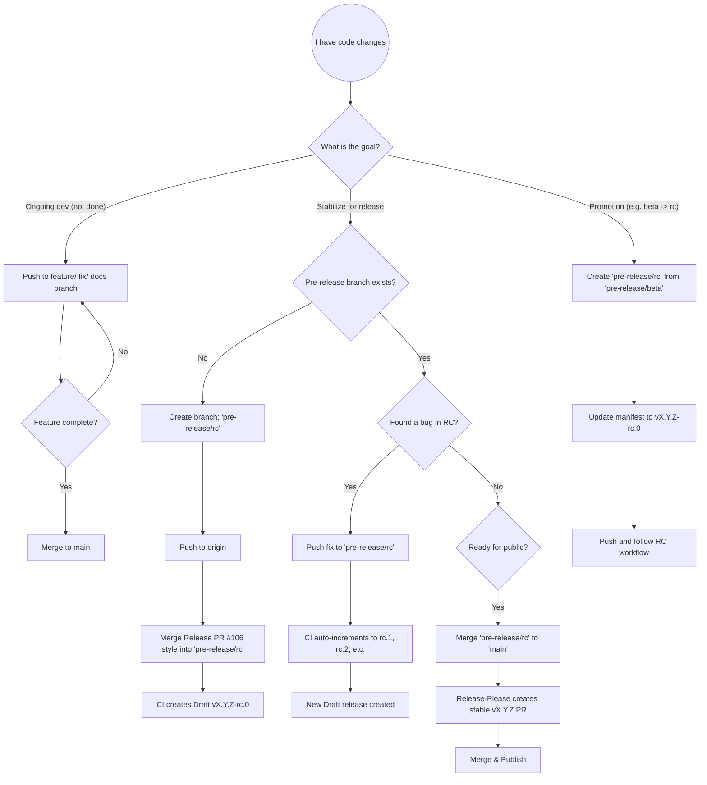

# Pre-release Process

This document describes how to create pre-releases for helpbutton.qs.

## Decision Tree: Choosing Your Workflow

Use the following diagram to determine the correct path based on your current goal:



## Overview

Pre-releases allow testing new features and fixes before general availability. They follow semantic versioning with pre-release identifiers (e.g., `2.5.0-alpha.1`, `2.5.0-beta.2`, `2.5.0-rc.1`).

## When to Use Pre-releases

- **Alpha**: Early testing of new features, may be unstable
- **Beta**: Feature-complete but needs broader testing
- **Release Candidate (RC)**: Stable enough for production testing before final release

## Creating a Pre-release

### Step 1: Create a Pre-release Branch

Create a branch from `main` following the naming convention:

```bash
git checkout main
git pull origin main
git checkout -b pre-release/alpha
# or
git checkout -b pre-release/beta
# or
git checkout -b pre-release/rc
```

### Step 2: Push the Branch

```bash
git push origin pre-release/alpha
# or
git push origin pre-release/beta
# or
git push origin pre-release/rc
```

### Step 3: Trigger the Workflow

The CI workflow will automatically detect the pre-release branch (any branch starting with `pre-release/`) and:

1. Create a pre-release PR using release-please
2. Generate a pre-release tag (e.g., `v2.5.0-alpha.1`)
3. Create a draft GitHub release marked as "This is a pre-release"
4. Build and upload release artifacts

### Step 4: Review and Publish

1. Review the auto-generated PR
2. Merge the PR when ready
3. The workflow will create a draft release
4. Go to GitHub Releases and publish the draft
5. Make sure the "This is a pre-release" checkbox is checked

### Step 5: Iterating (Subsequent RCs)

Once the first pre-release (e.g. `rc.0`) exists as a draft:

1. **Push code directly** to the pre-release branch (e.g. `pre-release/rc`).
2. The CI will automatically:
   - Identify the existing draft.
   - Increment the suffix (e.g., `rc.0` -> `rc.1`).
   - Update the draft with the new tag and updated assets.

## Versioning Strategy

Pre-releases use the format: `MAJOR.MINOR.PATCH-alpha.N`, `MAJOR.MINOR.PATCH-beta.N`, or `MAJOR.MINOR.PATCH-rc.N`

The version suffix is driven by the branch name suffix, which maps to a dedicated release-please config file:

| Branch | Config file | Version format |
|--------|-------------|----------------|
| `pre-release/alpha` | `release-please-prerelease-alpha.json` | `2.5.0-alpha.0` |
| `pre-release/beta` | `release-please-prerelease-beta.json` | `2.5.0-beta.0` |
| `pre-release/rc` | `release-please-prerelease-rc.json` | `2.5.0-rc.0` |
| `pre-release/<other>` | `release-please-prerelease.json` | `2.5.0` (no suffix) |

> [!IMPORTANT]
> Only the branch names `pre-release/alpha`, `pre-release/beta`, and `pre-release/rc` produce versioned suffixes (e.g. `-rc.0`). Any other `pre-release/*` branch falls back to the generic prerelease config and will produce a plain version number.

Examples:

- `2.5.0-alpha.0` - First alpha release
- `2.5.0-alpha.1` - Second alpha release (after another commit merged)
- `2.5.0-beta.0` - First beta release
- `2.5.0-rc.0` - First release candidate

## Promoting to Stable

When the pre-release is ready for general availability:

1. Merge all pre-release changes to `main`
2. The regular CI workflow will create a stable release (e.g., `2.5.0`)
3. Delete the pre-release branch (optional)

## Troubleshooting

### Workflow Not Triggering

- Ensure the branch name starts with `pre-release/`
- Check the workflow runs tab for errors
- Verify the `RELEASE_PLEASE_PAT` secret is configured

### Version Number Issues

- Release-please automatically increments versions based on commit messages
- Use conventional commit messages (feat:, fix:, chore:, etc.)
- Pre-releases will increment the prerelease identifier (alpha.1, alpha.2, etc.)

## Related Files

- `.github/workflows/ci.yaml` - CI workflow with pre-release support
- `release-please-config.json` - Stable release configuration
- `release-please-prerelease.json` - Generic pre-release configuration (no version suffix, used as fallback)
- `release-please-prerelease-alpha.json` - Alpha pre-release configuration (`-alpha.N` suffix)
- `release-please-prerelease-beta.json` - Beta pre-release configuration (`-beta.N` suffix)
- `release-please-prerelease-rc.json` - RC pre-release configuration (`-rc.N` suffix)
- `.release-please-manifest.json` - Version manifest (auto-updated)
