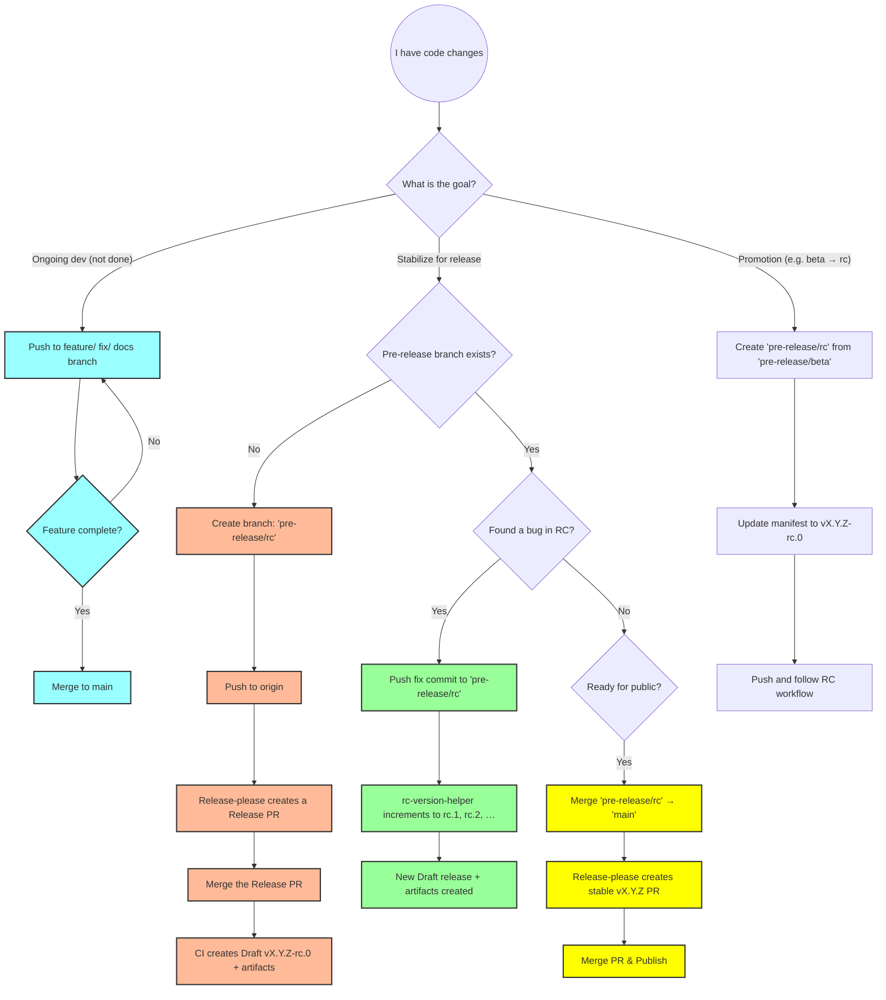

# Release Process

This document describes the full development and release workflow for helpbutton.qs, including pre-releases (alpha, beta, RC) and stable releases.

## Decision Tree: Choosing Your Workflow

Use the following diagram to determine the correct path based on your current goal:



### Legend

- <span style="color:#9ff">**Blue**</span>: Standard Development (feature branches).
- <span style="color:#fb9">**Orange**</span>: Initializing a Pre-release (creating the `rc` branch, first RC).
- <span style="color:#9f9">**Green**</span>: Iteration Mode (fixing bugs in RC, auto-incrementing `rc.N`).
- <span style="color:#ffff00">**Yellow**</span>: Promotion to Production (merging to `main` for stable release).

## Overview

Pre-releases allow testing new features and fixes before general availability. They follow semantic versioning with pre-release identifiers (e.g., `2.5.0-alpha.1`, `2.5.0-beta.2`, `2.5.0-rc.1`).

## When to Use Pre-releases

- **Alpha**: Early testing of new features, may be unstable
- **Beta**: Feature-complete but needs broader testing
- **Release Candidate (RC)**: Stable enough for production testing before final release

## Creating a Pre-release

### Step 1: Create a Pre-release Branch

Create a branch from `main` following the naming convention:

```bash
git checkout main
git pull origin main
git checkout -b pre-release/rc
# or: pre-release/alpha, pre-release/beta
```

### Step 2: Push the Branch

```bash
git push origin pre-release/rc
```

### Step 3: First CI Run — Release-Please Creates a PR

On the first push to a new `pre-release/*` branch, the CI workflow:

1. Runs `rc-version-helper.mjs`, which detects no existing pre-release for this base version.
2. Delegates to **release-please**, which creates a **Release PR** targeting the pre-release branch.
3. The Release PR updates the changelog and version numbers in the manifest.

> [!NOTE]
> At this point, no draft release or artifacts exist yet — only the PR.

### Step 4: Merge the Release PR → First Draft Release (rc.0)

1. Review and merge the Release PR.
2. The merge triggers CI again. This time release-please **creates a draft GitHub release** (e.g., `v2.5.0-rc.0`).
3. The `build-release` job runs: builds artifacts, generates PDFs, creates zip files, and uploads them to the draft release.
4. Go to GitHub Releases, review the draft, and publish it.
5. Make sure the "This is a pre-release" checkbox is checked.

### Step 5: Iterating (rc.1, rc.2, …)

Once the first pre-release (e.g., `rc.0`) exists as a GitHub release:

1. **Push fix/improvement commits directly** to the `pre-release/rc` branch.
2. The CI will automatically:
   - Run `rc-version-helper.mjs`, which finds existing `rc.N` releases and computes the next N.
   - Set `releases_created=true` with the new tag (e.g., `v2.5.0-rc.1`).
   - The `build-release` job creates a **new** draft release with the incremented tag and fresh artifacts.
3. Review and publish the new draft on GitHub Releases.

> [!IMPORTANT]
> Each iteration creates a **new separate draft release** (rc.1, rc.2, etc.) — it does not update the previous one.

### Commits During RC Iteration

**Yes, use conventional commits** (`fix:`, `feat:`, `chore:`, etc.) — always. They serve two purposes:

1. **Changelog entries**: Commit messages are included in release notes.
2. **Base version calculation**: `rc-version-helper.mjs` scans all commits since the latest stable tag to determine the bump level (major / minor / patch). This determines the `X.Y.Z` in `vX.Y.Z-rc.N`.

> [!WARNING]
> **Gotcha — introducing `feat:` during RC can shift the base version.**
>
> Example: Latest stable is `v2.5.0`. You start with only `fix:` commits, so the base version is `2.5.1` and you get `v2.5.1-rc.0`. If you later push a `feat:` commit, the helper recalculates the base as `2.6.0`. It then looks for `v2.6.0-rc.N` releases, finds none, and falls back to release-please — which creates a new Release PR for `v2.6.0-rc.0` instead of incrementing to `v2.5.1-rc.1`.
>
> **Recommendation**: During RC iteration, stick to `fix:` and `chore:` commits. If a feature is truly needed, expect the base version to shift, and merge the resulting new Release PR.

## Versioning Strategy

Pre-releases use the format: `MAJOR.MINOR.PATCH-TYPE.N`

The version suffix is driven by the branch name, which maps to a dedicated release-please config file:

| Branch | Config file | Version format |
|--------|-------------|----------------|
| `pre-release/alpha` | `release-please-prerelease-alpha.json` | `X.Y.Z-alpha.N` |
| `pre-release/beta` | `release-please-prerelease-beta.json` | `X.Y.Z-beta.N` |
| `pre-release/rc` | `release-please-prerelease-rc.json` | `X.Y.Z-rc.N` |
| `pre-release/<other>` | `release-please-prerelease.json` | `X.Y.Z` (no suffix) |

> [!IMPORTANT]
> Only the branch names `pre-release/alpha`, `pre-release/beta`, and `pre-release/rc` produce versioned suffixes (e.g., `-rc.0`). Any other `pre-release/*` branch falls back to the generic prerelease config and will produce a plain version number.

## Promoting to Stable

When the pre-release is ready for general availability:

1. Merge the `pre-release/rc` branch to `main`.
2. The CI triggers on `main`: release-please creates a stable Release PR (e.g., `v2.5.1`).
3. Merge that PR to publish the stable release.
4. Delete the pre-release branch.

## How the CI Pipeline Works Internally

The `release-please` job in CI has two possible code paths, selected by `rc-version-helper.mjs`:

| Scenario | Helper output | What happens |
|----------|--------------|--------------|
| Push to `main` | `action=run_release_please` | Standard release-please flow. |
| First push to `pre-release/*` (no existing RC releases) | `action=run_release_please` | Release-please runs with the prerelease config, creates a Release PR. |
| Subsequent push to `pre-release/*` (existing RC releases found) | `action=increment_rc` + `releases_created=true` | Skips release-please. Directly sets the next `rc.N` tag. `build-release` job creates draft + artifacts. |

The `build-release` job only runs when `releases_created == true`. It builds zips, generates PDFs, and uploads everything to the GitHub release via `ncipollo/release-action`.

## Tips and Known Behaviours

### CHANGELOG is Not Updated During RC Iterations

When `rc-version-helper.mjs` takes the `increment_rc` path (rc.1, rc.2, …), it bypasses release-please entirely. This means the `CHANGELOG.md` file in the repo is only updated during the initial `rc.0` creation (when release-please runs and a Release PR is merged). Subsequent RC iterations get new draft releases on GitHub — with auto-generated release notes — but the in-repo CHANGELOG is not touched until the stable release.

### Each RC Iteration Creates a New Draft Release

The CI does **not** update the previous draft in place. Each push to the pre-release branch (after `rc.0` exists) creates a brand-new draft release (`rc.1`, `rc.2`, etc.) with its own tag, artifacts, and release notes. Old drafts remain as-is; delete them manually if desired.

### The `ncipollo/release-action` Uses `allowUpdates: true`

If a release with the same tag already exists, the upload step will update its artifacts rather than fail. This is relevant if a CI run is re-triggered for an existing tag.

### Pre-release Naming Fix

The CI has a final step (`Fix pre-release name to include type suffix`) that renames the GitHub release title to include the `-rc.N` suffix if release-please did not already include it. This is a cosmetic fix — the tag is always correct.

### `workflow_dispatch` Is Enabled

The CI can be triggered manually from the GitHub Actions UI on any matched branch (`main` or `pre-release/*`). Useful for retrying a failed run without pushing a dummy commit.

## Troubleshooting

### Workflow Not Triggering

- Ensure the branch name starts with `pre-release/`
- Check the workflow runs tab for errors
- Verify the `RELEASE_PLEASE_PAT` secret is configured

### Version Number Issues

- Release-please automatically determines the version bump from conventional commit messages
- Use conventional commit messages (`feat:`, `fix:`, `chore:`, `refactor:`, `docs:`, etc.)
- `feat:` → minor bump, `fix:` → patch bump, `BREAKING CHANGE` → major bump
- Pre-releases increment the `.N` suffix automatically on each push

### Unexpected Base Version Shift During RC

If the base version changes mid-RC (e.g., `2.5.1-rc.2` → `2.6.0-rc.0`), a `feat:` commit was likely pushed. See the warning in [Commits During RC Iteration](#commits-during-rc-iteration).

### Stale Drafts After Base Version Shift

If the base version shifts (e.g., from `2.5.1` to `2.6.0`), previous RC drafts (`v2.5.1-rc.0`, `v2.5.1-rc.1`, …) are orphaned. They won't be updated or deleted automatically. Clean them up manually in GitHub Releases.

## Related Files

- `.github/workflows/ci.yaml` — CI workflow with pre-release support
- `scripts/rc-version-helper.mjs` — Decides whether to run release-please or increment RC counter
- `release-please-config.json` — Stable release configuration
- `release-please-prerelease.json` — Generic pre-release configuration (no version suffix, used as fallback)
- `release-please-prerelease-alpha.json` — Alpha pre-release configuration (`-alpha.N` suffix)
- `release-please-prerelease-beta.json` — Beta pre-release configuration (`-beta.N` suffix)
- `release-please-prerelease-rc.json` — RC pre-release configuration (`-rc.N` suffix)
- `.release-please-manifest.json` — Version manifest (auto-updated)
