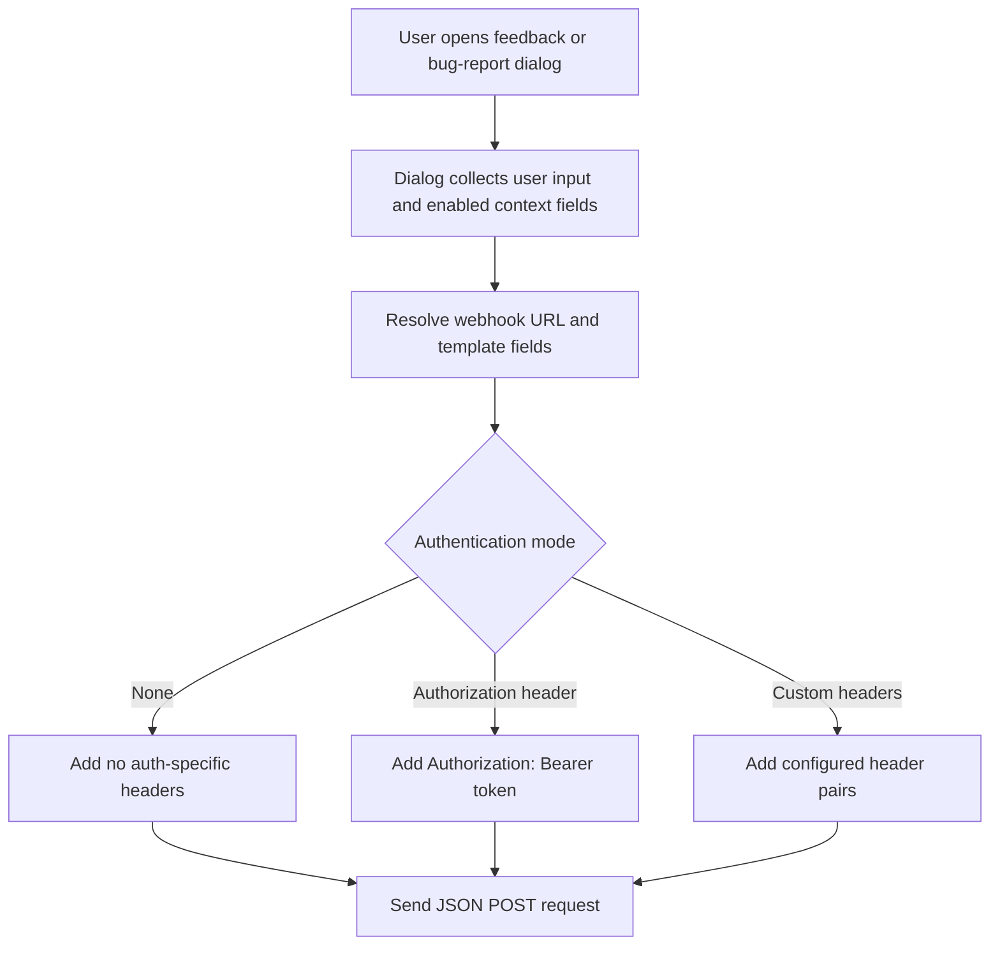

# Feedback and Bug Report Authentication

The feedback and bug-report menu items can send JSON payloads to a webhook endpoint. This guide explains what the three current modes in the Authentication dropdown do, how the extension builds the outgoing headers, and which trade-offs matter when you choose one.

This document applies to the authentication settings for both dialog types:

| Menu item  | Authentication property  | Extra fields shown when selected                                                               |
| ---------- | ------------------------ | ---------------------------------------------------------------------------------------------- |
| Bug report | `bugReport.authStrategy` | `bugReport.authToken` for Authorization header, `bugReport.customHeaders[]` for Custom headers |
| Feedback   | `feedback.authStrategy`  | `feedback.authToken` for Authorization header, `feedback.customHeaders[]` for Custom headers   |

The property-panel labels are the same in both places:

- None
- Authorization header
- Custom headers

Older layouts that still contain the removed `sense-session` value are normalized to `none`, and the extension logs a warning so the obsolete configuration is visible.

## Shared Request Flow



Both dialogs behave the same way at request time:

- The dialog collects the user's input together with the enabled context fields.
- The webhook URL is resolved at send time, including any `{{template}}` placeholders.
- The request body is sent as JSON.
- `Content-Type: application/json` is always added.
- The selected auth mode only changes the outgoing headers. It does not change the payload structure.
- The request is sent from the browser with `fetch()`, so normal browser networking rules still apply.

## Auth Modes at a Glance

| Property-panel label | Internal value | What the extension adds                                         | Typical fit                                       |
| -------------------- | -------------- | --------------------------------------------------------------- | ------------------------------------------------- |
| None                 | `none`         | No auth-specific headers beyond the normal JSON request headers | Endpoints that do not require header-based auth   |
| Authorization header | `header`       | `Authorization: Bearer <token>`                                 | APIs that expect a bearer token                   |
| Custom headers       | `custom`       | Each configured header pair from the property panel             | Gateways or APIs that require fixed named headers |

## None

`None` does not add any auth-specific header. The request still carries `Content-Type: application/json`, and the browser may still attach its own standard networking metadata.

How it works:

- The header builder returns an empty auth-header object.
- No bearer-token field or custom-header editor is shown in the property panel.
- The payload shape is identical to the other modes; only the auth headers are absent.

Use this mode when the webhook endpoint is intentionally open to the caller path, when authentication is enforced somewhere else, or when you are testing basic payload delivery first.

## Authorization Header

This mode adds a bearer token using the standard `Authorization` header:

```http
Authorization: Bearer <token>
```

How it works:

- The property panel shows a `Bearer token` field.
- The token field supports expressions, so the final value can be resolved dynamically.
- When the dialog sends the request, the extension builds `Authorization: Bearer <token>` from the resolved token value.
- If the token resolves to an empty string, no `Authorization` header is added.

Use this mode when your webhook expects bearer-token auth. It is the simplest choice for API gateways, webhook receivers, and backends that already use `Authorization` headers.

## Custom Headers

This mode lets you define the exact header names and values that should be sent.

How it works:

- The property panel shows a `Custom headers` array.
- Each row becomes one outgoing header when both `name` and `value` are non-empty.
- Both header names and values support expressions.
- The configured pairs are forwarded as entered.
- If the same header name is configured more than once, the later value overwrites the earlier one in the constructed headers object.

Use this mode when the endpoint expects headers such as `X-API-Key`, `X-Environment`, `X-Tenant`, or similar values that do not fit the bearer-token pattern.

## Payload Preview and Operational Caveats

When `Show payload` is enabled for a feedback or bug-report item, the payload preview dialog applies the same auth-mode rules that the real request uses.

- Bearer-token values and other sensitive-looking header values are redacted in the preview.
- The dialog can open even if the webhook URL is empty. If the endpoint is missing or invalid, the request still fails later when the user tries to send it.
- There is no built-in retry logic.
- Cross-origin endpoints must allow the request under normal browser CORS rules.

## Choosing the Right Mode

| If your endpoint expects         | Recommended mode     |
| -------------------------------- | -------------------- |
| No auth header                   | None                 |
| `Authorization: Bearer ...`      | Authorization header |
| One or more named custom headers | Custom headers       |

## Related Documentation

- [Menu Items - App Developer Guide](./menu-items-app-developer.md)
- [Property Panel Reference](./property-panel-reference.md)
- [Template Fields](./template-fields.md)
