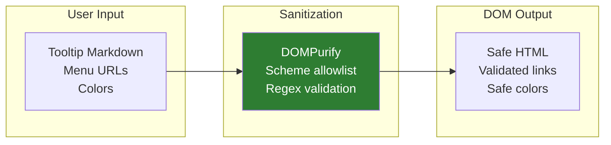
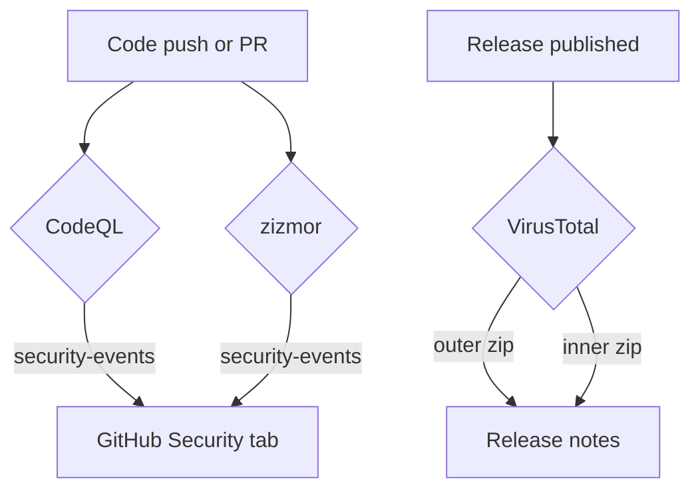

# Security Overview for App Developers

This document describes the security controls applied throughout the HelpButton.qs project — from the code that runs in your Qlik Sense app to the CI pipeline that builds and publishes each release. It is intended for Qlik Sense app developers and administrators who evaluate whether to install this extension in their environment.

For deep technical details on the runtime sanitization pipeline, trust boundaries, and remaining known risks, see [Security — Tooltip & Menu System](../extension-developer/SECURITY.md).

## Runtime protections

The extension runs in the browser of every user who views a sheet where it is installed. The following controls protect against common web application vulnerabilities:

| Control                          | What it does                                                                                                                                                                                                                                                                  |
| -------------------------------- | ----------------------------------------------------------------------------------------------------------------------------------------------------------------------------------------------------------------------------------------------------------------------------- |
| **DOMPurify sanitization**       | All rich-text content (tooltip hover content, dialog bodies, Markdown previews) is passed through DOMPurify before being inserted into the DOM. This strips `<script>` tags, event handlers (`onclick`, `onerror`, etc.), `javascript:` URIs, and other dangerous constructs. |
| **URL scheme validation**        | Menu item links are validated against a scheme allowlist (`http://`, `https://`, relative paths). Dangerous schemes such as `javascript:` and `data:` are rejected.                                                                                                           |
| **Color validation**             | Color values inserted into SVG markup are validated against a strict regex before interpolation. Invalid values fall back to `currentColor`.                                                                                                                                  |
| **Optional URI allowlist**       | Administrators can configure a comma-separated list of allowed URL prefixes for embedded `<iframe>`, `<video>`, and `<source>` elements in tooltip content. When empty (the default), all `https://` sources are accepted.                                                    |
| **Minimal runtime dependencies** | The extension has a single runtime dependency — `dompurify`. This reduces the attack surface compared to extensions with large dependency trees.                                                                                                                              |
| **`textContent` for plain text** | Labels, titles, and other plain-text fields are inserted using `textContent` or the browser's CSSOM API, which do not interpret HTML.                                                                                                                                         |

## Supply chain security

The build and release pipeline is designed to produce reproducible, verifiable artifacts:

| Control                       | What it does                                                                                                                        |
| ----------------------------- | ----------------------------------------------------------------------------------------------------------------------------------- |
| **Deterministic builds**      | Releases are built with `npm ci` (not `npm install`), which installs the exact dependency versions recorded in `package-lock.json`. |
| **CycloneDX SBOM**            | Every release includes a machine-readable Software Bill of Materials (`*.sbom.cdx.json`) listing all production dependencies.       |
| **Pinned GitHub Actions**     | All third-party actions in CI workflows are pinned to full commit SHAs, not mutable tags like `v1` or `v2`.                         |
| **No credential persistence** | Checkout step uses `persist-credentials: false`, preventing the `GITHUB_TOKEN` from leaking into subsequent build steps.            |
| **Default-deny permissions**  | Workflows starts with `permissions: {}` and grants only the minimum permissions required for its specific steps.                    |

## Automated security scanning

The repository runs multiple automated security analyses on every change:

| Scanner        | Trigger                                                             | What it checks                                                                                   | Results visible in                                                              |
| -------------- | ------------------------------------------------------------------- | ------------------------------------------------------------------------------------------------ | ------------------------------------------------------------------------------- |
| **CodeQL**     | Every push/PR to `main` + weekly scheduled run (Saturday 22:00 UTC) | Static analysis for JavaScript vulnerabilities, injection flaws, and insecure patterns           | [GitHub Security tab](https://github.com/ptarmiganlabs/help-button.qs/security) |
| **zizmor**     | Every push/PR to `main` and `pre-release/**` branches               | Security analysis of GitHub Actions workflow configurations                                      | [GitHub Security tab](https://github.com/ptarmiganlabs/help-button.qs/security) |
| **VirusTotal** | Every published release                                             | Scans both the outer release zip and the inner `helpbutton-qs.zip` extension package for malware | Release notes (analysis links appended automatically)                           |

## Dependency management

| Control                         | What it does                                                                                                                                                      |
| ------------------------------- | ----------------------------------------------------------------------------------------------------------------------------------------------------------------- |
| **Dependabot — npm**            | Weekly checks for outdated npm dependencies. A 7-day cooldown prevents update storms and gives time for review.                                                   |
| **Dependabot — GitHub Actions** | Weekly checks for outdated CI action versions. Same 7-day cooldown. Certain actions managed by external compilers are excluded from automated bumps.              |
| **Minimal runtime surface**     | Only `dompurify` is a runtime dependency. All other packages (ESLint, Prettier, Nebula.js CLI, etc.) are dev dependencies and are not shipped with the extension. |

## Secure release process

Releases follow a controlled, automated pipeline:

1. **Release-please** detects version bumps and creates a GitHub release.
2. **CI build job** checks out the tagged commit, runs `npm ci`, and builds the extension with `npm run pack:prod`.
3. **SBOM generation** produces a CycloneDX inventory of production dependencies.
4. **Release artifacts** (extension zip, README PDF, LICENSE, SBOM) are uploaded to the release.
5. **VirusTotal** scans both the outer release zip and the inner extension zip, appending analysis links to the release body.

No release artifact is edited by hand after the build.

## Pre-commit enforcement

During development, a Husky pre-commit hook runs automatically before each commit:

1. **`lint-staged`** formats and lints all staged files using Prettier and ESLint.
2. **`gitleaks`** (if installed locally) scans staged changes for accidentally committed secrets such as API keys or tokens.

If `gitleaks` is not installed, the hook prints a warning and continues without failing. This helps catch credential leaks before they reach the repository.

## Responsible disclosure

| Channel                     | Details                                                                                                                                        |
| --------------------------- | ---------------------------------------------------------------------------------------------------------------------------------------------- |
| **GitHub Private Advisory** | [Create a private security advisory](https://github.com/ptarmiganlabs/help-button.qs/security/advisories/new) in the repository's Security tab |
| **Email**                   | security@ptarmiganlabs.com                                                                                                                     |

**Do not open a public GitHub issue for security vulnerabilities.** The project supports the latest released version only.

## Recommendations for app developers

- **Configure the URI allowlist** in the property panel's Security section if you embed videos or iframes in tooltips, to restrict sources to trusted origins.
- **Review webhook URLs** before deploying the extension widely — only configure endpoints you control or trust.
- **Keep the extension updated** to benefit from the latest security patches and dependency updates.
- **Use Qlik expressions responsibly** — expressions in tooltip content execute with the viewing user's permissions, which is consistent with Qlik's security model but worth considering when designing content.
