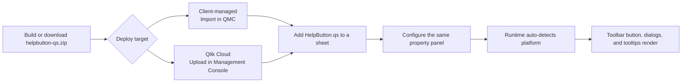

# Qlik Sense Client-Managed vs Qlik Cloud — Sense App Developer Guide

HelpButton.qs can be used in both **client-managed Qlik Sense Enterprise on Windows** and **Qlik Cloud**. As an app developer, you use the same extension object and almost the same property-panel workflow on both platforms, but some runtime details differ.

This guide focuses on those app-developer-relevant differences: deployment, context fields, template values, tooltip targeting, and what to test before you roll out to users.

All behavioral statements in this guide are based on the current implementation in `src/`, which is the authoritative truth.

---

## Table of Contents

- [Qlik Sense Client-Managed vs Qlik Cloud — Sense App Developer Guide](#qlik-sense-client-managed-vs-qlik-cloud--sense-app-developer-guide)
  - [Table of Contents](#table-of-contents)
  - [Overview](#overview)
  - [What Stays the Same](#what-stays-the-same)
  - [What Differs](#what-differs)
  - [Template Fields and Context Payloads](#template-fields-and-context-payloads)
  - [Tooltips and Selector Targeting](#tooltips-and-selector-targeting)
  - [Recommended Configuration Patterns](#recommended-configuration-patterns)
  - [Rollout Checklist](#rollout-checklist)

---

## Overview

At a high level:

- You deploy the **same extension package** on both platforms.
- You configure the **same HelpButton.qs object** from the sheet property panel.
- The extension **auto-detects** whether it is running on `client-managed` or `cloud`.
- Platform-specific behavior is mostly about **context data** and **DOM differences**, not about a different app-developer workflow.

---

## What Stays the Same

These parts work the same way on both platforms:

- You import/upload the compiled `helpbutton-qs.zip` extension package.
- You add **HelpButton.qs** to a sheet in edit mode.
- You configure menu items, bug report items, feedback items, tooltips, theme presets, and translations from the same property panel.
- The button is injected into the global toolbar rather than living inside the grid cell in analysis mode.
- `{{appId}}` and `{{sheetId}}` template placeholders are available on both platforms.
- Bug report and feedback dialogs use the same field catalog and the same payload structure.
- Tooltips support both **Qlik Sense object** targeting and **CSS selector** targeting on both platforms.

If you stay within those shared capabilities, one app configuration can often be reused unchanged across both client-managed and Cloud deployments.

---

## What Differs

The main practical differences are below.

| Area | Client-managed | Qlik Cloud | App developer impact |
| --- | --- | --- | --- |
| **Extension import** | Import via **QMC → Extensions** | Upload via **Management Console → Extensions** | Deployment step differs, but the package is the same |
| **Detected platform value** | `client-managed` | `cloud` | The `platform` context field tells you which runtime the user is in |
| **Toolbar anchor in the DOM** | `#top-bar-right-side` | `[data-testid="top-bar-right-side"]` | Toolbar internals differ, but HelpButton.qs handles this automatically |
| **`userId`** | Qlik/Windows-style user ID from `/qps/user` | Email address from `/api/v1/users/me` | If you send `userId` to a backend, expect different formats |
| **`userDirectory`** | Available | Empty / not applicable | Avoid relying on it in Cloud links or payloads |
| **`senseVersion`** | Available | Reported as `N/A` | Only useful in client-managed troubleshooting flows |
| **Cloud-only user fields** | `tenantId`, `status`, `picture`, `preferredZoneinfo`, `roles` are `N/A` | Available from `/api/v1/users/me` | You can enrich Cloud bug/feedback payloads with extra identity metadata |
| **Tooltip CSS selectors** | DOM shape is client-managed-specific | DOM shape is Cloud-specific | Test any custom selector separately on each platform |
| **Content library path examples** | `/content/Default/` is documented as a valid tooltip allow-prefix example | No equivalent built-in example is documented in this repo | Client-managed-only path assumptions should not be copied into Cloud configs |

Important nuance:

- The extension does **not** ask you to pick a platform manually.
- Platform adaptation is automatic and happens at runtime.
- The differences mainly matter when you configure **dynamic URLs**, **webhook payload fields**, or **custom tooltip selectors**.

---

## Template Fields and Context Payloads

### Template placeholders

The currently supported template placeholders are:

| Placeholder | Client-managed | Qlik Cloud |
| --- | --- | --- |
| `{{appId}}` | Current app GUID | Current app GUID |
| `{{sheetId}}` | Current sheet ID | Current sheet ID |
| `{{userId}}` | Logged-in user ID | User email address |
| `{{userDirectory}}` | Directory name | Empty string |

Practical implication:

- `{{appId}}` and `{{sheetId}}` are the safest cross-platform placeholders.
- `{{userId}}` is cross-platform, but its meaning changes from **login name** to **email address**.
- `{{userDirectory}}` is client-managed-specific.

### Bug report and feedback context fields

HelpButton.qs uses a shared context-field model for bug report and feedback actions. The most important platform differences are:

| Field | Client-managed | Qlik Cloud |
| --- | --- | --- |
| `userName` | Full name from proxy API | Display name from `/api/v1/users/me` |
| `userId` | User ID | Email address |
| `userDirectory` | Available | `N/A` / not applicable |
| `senseVersion` | Available | `N/A` |
| `tenantId` | `N/A` | Available |
| `status` | `N/A` | Available |
| `picture` | `N/A` | Available |
| `preferredZoneinfo` | `N/A` | Available |
| `roles` | `N/A` | Available |
| `platform` | `client-managed` | `cloud` |

This matters when:

- You build URLs that pre-fill a support system
- You choose which fields to show in the dialog
- You choose which fields to include in the webhook payload
- Your backend expects a specific user-identity format

---

## Tooltips and Selector Targeting

For tooltips, the most important cross-platform rule is:

> Prefer **Target type = Qlik Sense object** whenever possible.

Why:

- The object-targeting path is much more stable across platforms.
- Both adapters resolve objects by the same object-ID pattern.
- CSS selectors are tied to the page DOM, and that DOM differs between client-managed and Cloud.

What to watch out for:

- A selector that works in client-managed may fail in Cloud.
- A selector copied from browser DevTools is often too fragile even within one platform.
- Toolbar and page-shell internals are especially platform-specific because the extension uses different platform selector registries under the hood.

Example:

- `#sheet-title > header` is documented in this repo as a working **client-managed** selector as of November 2025.
- Do **not** assume that same selector works in Cloud.

If you use **Security → Allowed URI prefixes** for embedded tooltip content, note that `/content/Default/` is documented here as a client-managed content-library example.

---

## Recommended Configuration Patterns

### If you want one configuration that works well on both platforms

Prefer:

- Link URLs based on `{{appId}}`, `{{sheetId}}`, and optionally `{{userId}}`
- Dialog context fields such as `userName,platform,appId,sheetId,urlPath,timestamp`
- Tooltip targeting by **Qlik Sense object**

Avoid or treat carefully:

- `{{userDirectory}}`
- `senseVersion`
- CSS selectors copied from one platform and reused blindly on the other

### If the app is only for client-managed Qlik Sense

You can lean more on:

- `userDirectory`
- `senseVersion`
- Client-managed-tested selectors such as the documented sheet-title example
- Client-managed content paths such as `/content/Default/`

### If the app is only for Qlik Cloud

You can take advantage of:

- Cloud user identity from `/api/v1/users/me`
- Extra payload fields such as `tenantId`, `status`, `preferredZoneinfo`, and `roles`
- Cloud-specific testing of any CSS selector that targets page chrome rather than a Qlik object

---

## Rollout Checklist

Before shipping an app that uses HelpButton.qs on one or both platforms, verify:

1. The extension package was deployed in the correct admin console for that platform.
2. The HelpButton.qs object appears on the sheet and the toolbar button renders in analysis mode.
3. Any URL using template placeholders resolves correctly on the target platform.
4. Any bug report or feedback webhook receives the field set you expect.
5. If you use `userId`, your backend accepts both login-name and email-style identities as needed.
6. If you use `userDirectory` or `senseVersion`, you only depend on them in client-managed deployments.
7. If you use tooltip CSS selectors, you test them in the actual target platform instead of assuming DOM parity.

If you follow those checks, HelpButton.qs can be used successfully in both client-managed Qlik Sense and Qlik Cloud with very little platform-specific branching in your app design.
