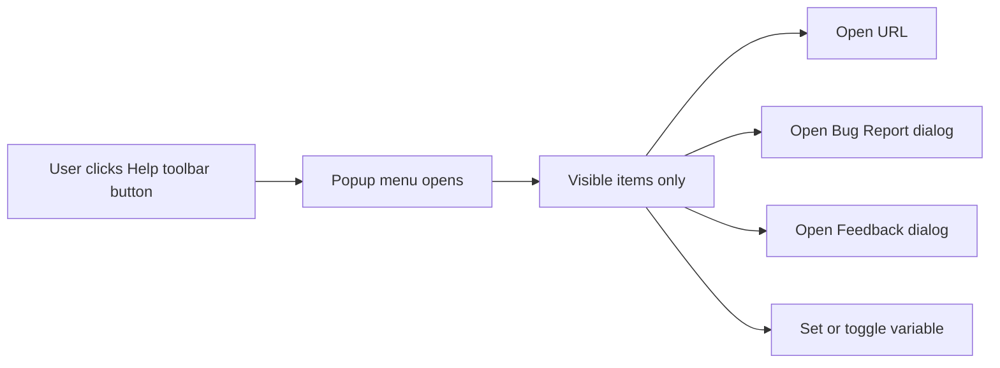
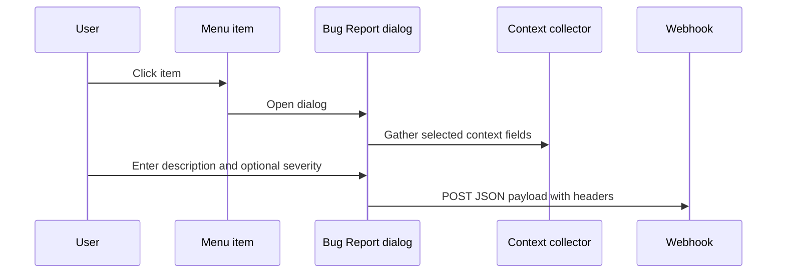
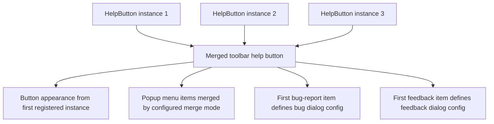

# Menu Items — Sense App Developer Guide

HelpButton.qs menu items turn the toolbar help button into a configurable action menu for your Qlik Sense app. Each menu item can do one of four things:

- Open a URL
- Open a bug report dialog
- Open a feedback dialog
- Set or toggle one or more Qlik variables

This guide explains the feature from an app developer's perspective: what to configure in the property panel, how each action behaves at runtime, and which edge cases matter when you design a production-ready help menu.

All behavioral statements in this guide are based on the source code in `src`, which is the authoritative implementation.

---

## Table of Contents

- [Menu Items — Sense App Developer Guide](#menu-items--sense-app-developer-guide)
  - [Table of Contents](#table-of-contents)
  - [Overview](#overview)
  - [When the Help Menu Appears](#when-the-help-menu-appears)
  - [Adding a Menu Item](#adding-a-menu-item)
  - [How Menu Items Work at Runtime](#how-menu-items-work-at-runtime)
  - [Common Menu Item Settings](#common-menu-item-settings)
  - [Show Condition (Visibility)](#show-condition-visibility)
  - [Item Colors and Theme Presets](#item-colors-and-theme-presets)
  - [Action Type: Open URL](#action-type-open-url)
  - [Supported URL and Webhook Template Fields](#supported-url-and-webhook-template-fields)
  - [Action Type: Open Bug Report Dialog](#action-type-open-bug-report-dialog)
  - [Action Type: Open Feedback Dialog](#action-type-open-feedback-dialog)
  - [Action Type: Set or Toggle Variable](#action-type-set-or-toggle-variable)
  - [Multi-Instance Behavior](#multi-instance-behavior)
  - [Troubleshooting](#troubleshooting)
  - [Field Limits and Defaults](#field-limits-and-defaults)

---

## Overview

The **Menu Items** section controls the contents of the HelpButton.qs popup menu. It does **not** control the toolbar button's own label, tooltip, icon, or popup title. Those are configured elsewhere in the property panel.

Think of the feature in two layers:

| Layer                              | Configured where          | What it controls                                                                   |
| ---------------------------------- | ------------------------- | ---------------------------------------------------------------------------------- |
| **Toolbar button and popup shell** | Button and Popup sections | Button label, button icon, button colors, popup title, popup border/header styling |
| **Menu items**                     | Menu Items section        | The clickable commands inside the popup                                            |

The Menu Items section is array-based, which means you can:

- Add any number of items
- Remove items
- Reorder items
- Duplicate items

Top-level property-panel refs in this section:

| UI label             | Ref                 | Type     | Purpose                                                                          |
| -------------------- | ------------------- | -------- | -------------------------------------------------------------------------------- |
| **Merge menu items** | `menuItemMergeMode` | `string` | Controls how menu items from multiple active HelpButton.qs objects are combined. |
| **Menu Items**       | `menuItems`         | `array`  | Stores the ordered list of configured menu items.                                |

The popup renders items in the same order they appear in the property panel.

---

## When the Help Menu Appears

The toolbar help button is only injected when the extension has **at least one menu item**.

- If `menuItems` is empty, the toolbar button is not rendered.
- In **edit mode**, the extension cell shows a placeholder, but the toolbar button is still kept visible in the page toolbar.
- In **analysis mode**, the toolbar button is also rendered and the extension can inject tooltips at the same time.
- The toolbar button is managed as a page-level singleton, so it can persist across sheet navigation within the same browser session after a sheet has registered it.

This means you configure the menu from the sheet object in edit mode, but you can still test the toolbar menu while editing.

---

## Adding a Menu Item

1. Select the HelpButton.qs object on the sheet.
2. Open the **Property Panel**.
3. Expand **Menu Items**.
4. Click **Add Menu Item**.
5. Set the item's **Label** and **Action**.
6. Configure the action-specific fields that appear below.
7. Optionally set **Show condition**, **Icon**, and **Item Colors**.

The property panel exposes different groups depending on the selected action:

| Action                     | Extra settings that appear |
| -------------------------- | -------------------------- |
| **Open URL**               | URL, Link target           |
| **Open Bug Report dialog** | Bug Report Settings        |
| **Open Feedback dialog**   | Feedback Settings          |
| **Set/Toggle variable**    | Variable Settings          |

---

## How Menu Items Work at Runtime



At runtime the popup behaves as follows:

- Menu items are filtered by **Show condition** before rendering.
- Separators are inserted **between visible items only**.
- Each item uses its own icon and per-item colors.
- Link items validate their URL before navigation.
- Bug report, feedback, and variable items dispatch to dedicated handlers.

Important implementation detail:

- URL template fields are resolved **when the user clicks the menu item**.
- Webhook template fields are resolved **when the dialog builds the payload preview or sends the POST request**.
- Variable actions execute only when the extension has access to the Qlik app object.

---

## Common Menu Item Settings

Every menu item starts with the same common settings.

| Setting            | Applies to    | Notes                                                                                |
| ------------------ | ------------- | ------------------------------------------------------------------------------------ |
| **Label**          | All actions   | Property-panel item title and popup text. Supports expressions. Max 128 characters.  |
| **Action**         | All actions   | One of: Open URL, Open Bug Report dialog, Open Feedback dialog, Set/Toggle variable. |
| **URL**            | Open URL only | Supports expressions and `{{template}}` fields. Max 2048 characters.                 |
| **Link target**    | Open URL only | `_blank` = new tab, `_self` = same tab.                                              |
| **Show condition** | All actions   | Optional expression or literal. Controls whether the item is rendered.               |
| **Icon**           | All actions   | Select from built-in icon set.                                                       |
| **Item Colors**    | All actions   | Per-item icon, background, hover background, and text colors.                        |

For multi-instance merge modes, only items with a non-empty **Label** take part in duplicate detection. If a menu item has no label, HelpButton.qs always appends it in registration order instead of trying to merge it with unlabeled items from other instances.

Supported menu item icons:

`Bell`, `Bookmark`, `Bug`, `Calendar`, `Chart bar`, `Check`, `Download`, `Eye`, `Flash`, `Globe`, `Heart`, `Help`, `Home`, `Info`, `Lightbulb`, `Link`, `Lock`, `Mail`, `Phone`, `Pin`, `Search`, `Settings`, `Star`, `Toggle`, `User`.

Many string fields in this area support Qlik expressions through the **fx** button, especially:

- Label
- URL
- Webhook URL
- Bearer token
- Custom header name and value
- Dialog title override
- Variable values
- Show condition

---

## Show Condition (Visibility)

The **Show condition** field is the main way to hide or show a menu item dynamically.

- If the field is empty, the item is shown.
- If the evaluated result is `0`, `'0'`, or `'false'` (case-insensitive), the item is hidden.
- Any other value shows the item.

Examples:

| Show condition                   | Result                                       |
| -------------------------------- | -------------------------------------------- |
| _(empty)_                        | Always visible                               |
| `1`                              | Always visible                               |
| `0`                              | Hidden                                       |
| `=False()`                       | Hidden                                       |
| `=True()`                        | Visible                                      |
| `=GetSelectedCount(Country) > 0` | Visible only when a Country selection exists |
| `=if(vCanSubmit = 1, 1, 0)`      | Visible only when `vCanSubmit` is `1`        |

How it works in practice:

- Qlik evaluates the expression and passes the result into the layout.
- The popup menu checks the resulting string value when it builds the visible list.
- The item is **not** re-evaluated on every click inside the popup. It changes when the extension layout refreshes and the menu is rebuilt.

---

## Item Colors and Theme Presets

Each menu item has its own color settings:

| Setting              | Purpose                   |
| -------------------- | ------------------------- |
| **Icon**             | SVG icon color            |
| **Background**       | Default background color  |
| **Hover background** | Background color on hover |
| **Text**             | Label color               |

These are applied directly to the popup item at runtime.

### Theme preset interaction

Theme presets also affect menu items.

When a preset is applied, the extension stamps preset colors onto each item:

- URL items use the preset's URL/default menu-item palette.
- Bug report items use the preset's bug-report palette.
- Feedback items use the preset's feedback palette.
- Variable items use the preset's set-variable palette.

Important nuance:

- Reapplying or changing a theme preset can overwrite your menu-item colors.
- For `bugReport`, `feedback`, and `setVariable` items, a preset can also replace the icon.
- URL items keep their chosen icon when a preset is applied.

Recommended approach:

1. Apply the theme preset you want.
2. Then fine-tune individual item colors if needed.

---

## Action Type: Open URL

Use **Open URL** when a menu item should navigate to documentation, Jira, ServiceNow, an internal support portal, another Qlik app, or any other web endpoint.

### Supported destinations

The implementation only allows these URL types:

- `http://...`
- `https://...`
- Relative paths starting with `/`
- Relative paths starting with `./`
- Relative paths starting with `../`

Everything else is blocked, including common schemes such as:

- `javascript:`
- `data:`
- `vbscript:`
- `mailto:`
- `tel:`
- `ftp:`

If the configured URL is unsafe, the item is not allowed to navigate.

### Link target

The **Link target** field controls where the URL opens:

| Value    | Behavior                 |
| -------- | ------------------------ |
| `_blank` | Opens in a new tab       |
| `_self`  | Opens in the current tab |

### Expressions and template fields

The URL field supports both:

- Qlik expressions
- Runtime `{{template}}` placeholders

This is useful when you want a URL that depends on the current app, sheet, or user.

Example:

```text
https://jira.example.com/create?app={{appId}}&sheet={{sheetId}}&user={{userId}}
```

### Relative URL examples

These are valid:

```text
/help/index.html
./support
../portal/tickets
```

---

## Supported URL and Webhook Template Fields

The implementation supports the same template placeholders in:

- Menu-item URLs
- Bug-report webhook URLs
- Feedback webhook URLs

Supported placeholders:

| Placeholder         | Client-managed                         | Cloud              |
| ------------------- | -------------------------------------- | ------------------ |
| `{{appId}}`         | Current app GUID                       | Current app GUID   |
| `{{sheetId}}`       | Current sheet ID                       | Current sheet ID   |
| `{{userId}}`        | Logged-in user ID                      | User email address |
| `{{userDirectory}}` | User directory, for example `INTERNAL` | Empty string       |

Notes:

- Template substitution happens at runtime, not when you save the property panel.
- Unresolved placeholders are replaced with an empty string.
- After substitution, repeated slashes in the path are normalized.

Example:

```text
https://support.example.com/new?app={{appId}}&sheet={{sheetId}}&user={{userId}}
```

---

## Action Type: Open Bug Report Dialog

Use **Open Bug Report dialog** when users should submit structured issue reports from inside Qlik Sense.

The bug-report item opens a modal dialog, gathers selected context fields, and sends a JSON payload to a webhook URL using `fetch()`.



### Bug report webhook and authentication

The bug-report dialog supports three authentication strategies:

| Strategy                 | What the code sends                            |
| ------------------------ | ---------------------------------------------- |
| **None**                 | No auth headers                                |
| **Authorization header** | `Authorization: Bearer <token>`                |
| **Custom headers**       | Exact name/value pairs from the property panel |

Important notes:

- The webhook URL supports expressions and template fields.
- The implementation does **not** validate that the webhook URL is non-empty before opening the dialog.
- There is no built-in retry logic.
- Browser networking rules such as CORS still apply.

### Bug report dialog options

| Setting                                        | Default                | Behavior                                                  |
| ---------------------------------------------- | ---------------------- | --------------------------------------------------------- |
| **Show severity picker (Low / Medium / High)** | On                     | Adds optional severity buttons to the dialog              |
| **Max description length**                     | 1000                   | Character limit for the end-user description field        |
| **Dialog title override**                      | Empty                  | Overrides the global bug-report title when set            |
| **Dialog timestamp format**                    | Default dialog format  | Used for timestamp shown in the dialog                    |
| **Payload timestamp format**                   | Default payload format | Used for timestamp sent in the payload                    |
| **Show 'Show payload' button**                 | Off                    | Opens a payload preview with the resolved URL and headers |

Notes:

- The description field is required before the **Submit** button is enabled.
- Severity is optional. If enabled, it is only included in the payload when the user picks a value.
- The description input uses the shared Write/Preview editor. The submitted payload contains the raw text the user entered.

### Feedback dialog vs payload fields

Bug report items let you configure the same field catalog in two separate ways:

| Group                  | What it controls                                                   |
| ---------------------- | ------------------------------------------------------------------ |
| **Show in Dialog**     | Which read-only context fields are visible to the user in the form |
| **Include in Payload** | Which context fields are sent to the webhook                       |

These groups are independent.

That means you can, for example:

- Show `userName` to the user but exclude it from the payload
- Hide `userId` in the dialog but still send it in the payload
- Rename payload keys to match your backend naming convention

### Available context fields

These fields are available in both the bug-report and feedback dialogs:

| Field               | Default | Notes                                                  |
| ------------------- | ------- | ------------------------------------------------------ |
| `userName`          | On      | Display name of the logged-in user                     |
| `platform`          | On      | `client-managed` or `cloud`                            |
| `appId`             | On      | Current app GUID                                       |
| `sheetId`           | On      | Current sheet ID                                       |
| `urlPath`           | On      | Current browser path and query string                  |
| `timestamp`         | On      | Timestamp formatted using the selected format          |
| `userId`            | Off     | Login identifier; Cloud maps this to the user's email  |
| `userDirectory`     | Off     | Directory name on client-managed; unavailable on Cloud |
| `senseVersion`      | Off     | Qlik Sense version; shown as `N/A` on Cloud            |
| `browser`           | Off     | Browser user-agent string                              |
| `tenantId`          | Off     | Tenant identifier when available                       |
| `status`            | Off     | User status when available                             |
| `picture`           | Off     | User picture URL when available                        |
| `preferredZoneinfo` | Off     | User time-zone information when available              |
| `roles`             | Off     | User roles when available                              |

### Payload key names

For every field that is included in the payload, you can also override the outgoing JSON key name.

Examples:

- `userName` -> `user_name`
- `appId` -> `qlik_app_id`
- `sheetId` -> `sheet_id`

If a payload key name is empty, the extension falls back to the field's internal name.

### Feedback payload shape

Bug reports are submitted as JSON with this structure:

```json
{
  "timestamp": "2026-05-26T13:45:12.345Z",
  "context": {
    "userName": "Alex Martin",
    "platform": "client-managed",
    "appId": "d6e7f080-ebe6-4bd1-a35d-bd8d2354fc48",
    "sheetId": "8e8be29d-1336-4971-8a7e-6a626b3d2363",
    "urlPath": "/sense/app/.../sheet/.../state/analysis",
    "timestamp": "2026-05-26T13:45:12.345Z"
  },
  "description": "The export button is disabled after changing Country.",
  "severity": "high"
}
```

Notes:

- `severity` is omitted unless the user selected one.
- The root `timestamp` is always included.
- The nested `context.timestamp` can use a different key name and a different format.

### Feedback dialog string precedence

The menu-item panel exposes a **Dialog title override** for bug report items. At runtime:

- Global bug-report strings are loaded first.
- The menu item's non-empty title override replaces the global title.
- Empty per-item values do not wipe out global values.

---

## Action Type: Open Feedback Dialog

Use **Open Feedback dialog** when users should submit lightweight product feedback, such as a rating, a comment, or both.

The feedback dialog is implemented similarly to the bug-report dialog, but the user input differs.

### Webhook and authentication

The feedback dialog uses the same webhook and authentication model as bug reports:

- None
- Authorization header using a bearer token
- Custom headers

The webhook URL also supports the same template fields described earlier.

### Dialog options

| Setting                          | Default                | Behavior                                              |
| -------------------------------- | ---------------------- | ----------------------------------------------------- |
| **Show star rating (1-5)**       | On                     | Displays a 1-5 star rating control                    |
| **Show free-text comment field** | On                     | Displays a comment field                              |
| **Max comment length**           | 500                    | Character limit for the comment field                 |
| **Dialog title override**        | Empty                  | Overrides the global feedback title                   |
| **Dialog timestamp format**      | Default dialog format  | Affects the dialog-only timestamp                     |
| **Payload timestamp format**     | Default payload format | Affects the sent timestamp                            |
| **Show 'Show payload' button**   | Off                    | Opens a preview of payload, headers, and resolved URL |

Submit behavior is different from bug reports:

- A description is **not** required, because there is no description field.
- The **Submit** button is enabled when the user has provided **at least one** of these:
  - A star rating
  - A non-empty comment

The comment input also uses the shared Write/Preview editor, and the payload contains the raw entered text.

### Show in Dialog vs Include in Payload

The feedback dialog uses the same two-layer field model as bug reports:

- **Show in Dialog** controls what the user sees.
- **Include in Payload** controls what is sent.

The same context field catalog and payload key renaming rules apply.

### Payload shape

Feedback is submitted as JSON with this structure:

```json
{
  "timestamp": "2026-05-26T13:45:12.345Z",
  "context": {
    "userName": "Alex Martin",
    "platform": "cloud",
    "appId": "d6e7f080-ebe6-4bd1-a35d-bd8d2354fc48",
    "sheetId": "8e8be29d-1336-4971-8a7e-6a626b3d2363"
  },
  "rating": 4,
  "comment": "The new help menu is much easier to use."
}
```

Notes:

- `rating` is only included if the user selected at least one star.
- `comment` is only included if the comment field is enabled and the user entered text.

### Dialog string precedence

Feedback title overrides follow the same precedence rules as bug reports:

- Global feedback strings are loaded first.
- The menu item's non-empty title override replaces the global title.

---

## Action Type: Set or Toggle Variable

Use **Set/Toggle variable** when the help menu should change app state directly, for example:

- Turn tooltips on or off
- Switch between compact and detailed layouts
- Set multiple helper variables at once

The variable action is executed through the Qlik app object and supports two modes.

| Mode                | What it does                                  |
| ------------------- | --------------------------------------------- |
| **Set variable(s)** | Sets one or more variables to specific values |
| **Toggle variable** | Flips one variable between two values         |

### Set variable(s)

In **Set** mode, the item contains an array of assignments:

| Field             | Purpose                                   |
| ----------------- | ----------------------------------------- |
| **Variable name** | Qlik variable to update                   |
| **Value**         | String value to set; supports expressions |

Behavior:

- Assignments run sequentially in the order shown in the property panel.
- Missing variable names are skipped.
- If one variable does not exist, the extension logs a warning and continues with the remaining assignments.

Example:

| Variable       | Value      |
| -------------- | ---------- |
| `vShowTooltip` | `1`        |
| `vHelpMode`    | `expanded` |

### Toggle variable

In **Toggle** mode, the item uses one variable and three values:

| Field                          | Purpose                                                 |
| ------------------------------ | ------------------------------------------------------- |
| **Variable name**              | Variable to read and update                             |
| **Value A**                    | First toggle value                                      |
| **Value B**                    | Second toggle value                                     |
| **Default value (safety net)** | Fallback when the current value matches neither A nor B |

Toggle logic:

1. Read the current variable value.
2. If the current value equals **Value A**, set **Value B**.
3. If the current value equals **Value B**, set **Value A**.
4. Otherwise set **Default value**.
5. If **Default value** is empty, the code falls back to **Value A**.

Example:

| Field         | Value          |
| ------------- | -------------- |
| Variable name | `vShowTooltip` |
| Value A       | `1`            |
| Value B       | `0`            |
| Default value | `1`            |

This makes the menu item behave like a tooltip on/off switch.

### Failure behavior

Variable items depend on app context.

- If no variable handler is available, the menu item is rendered as disabled.
- If the target variable does not exist, the action logs a warning and does nothing for that variable.
- Variable values are written as strings.

---

## Multi-Instance Behavior

If multiple HelpButton.qs objects are active in the same browser tab / app page session, the extension merges them into a single toolbar button.

This can happen in two common ways:

- two or more HelpButton.qs objects exist on the same sheet
- you navigate between sheets that each contain a HelpButton.qs object, because the toolbar button is session-persistent



Runtime rules:

- Menu items from all registered instances are merged into one popup.
- The first registered instance provides the button appearance and popup shell:
  - Button label
  - Button tooltip
  - Button icon
  - Button colors
  - Popup title
  - Popup styling
- The first registered instance also provides the **Merge menu items** setting that decides how contributed items are combined:
  - **Append all items** — current behavior, keeps every item in registration order
  - **Merge duplicate labels** — keeps the first visible item for each label (case-insensitive)
  - **Merge duplicate label + action pairs** — keeps the first visible item for each label/action pair
- Menu items without a non-empty label are never de-duplicated. They are always appended in registration order, even when one of the merge modes is selected.

Recommended default:

- Leave **Append all items** enabled if you intentionally build one larger shared menu from multiple HelpButton.qs objects.
- Use one of the de-duplication modes if copy/paste between sheets can create repeated menu entries.

Important caveat for dialog actions:

- The bug-report dialog configuration is taken from the **first** menu item whose action is `bugReport`.
- The feedback dialog configuration is taken from the **first** menu item whose action is `feedback`.
- Additional bug-report items are still clickable, but they open the same dialog configuration as the first matching item.
- Additional feedback items behave the same way.

This is the single most important runtime nuance to understand when designing complex menus.

Recommended practice:

1. Keep one canonical bug-report item per merged menu.
2. Keep one canonical feedback item per merged menu.
3. If you use multiple HelpButton.qs objects on the same sheet, decide explicitly which one should define the shared dialog behavior.

---

## Troubleshooting

### The toolbar button does not appear

Check these first:

- The extension has at least one menu item.
- The sheet has finished loading and the toolbar anchor is available.
- You are testing in the same page session where the extension is mounted.

### A menu item is missing

Most common causes:

- **Show condition** evaluated to `0` or `False()`.
- The item exists, but you are looking at a merged multi-instance menu and the order changed.

### A URL item does nothing

Check these:

- The URL uses `http`, `https`, or a relative path.
- The URL did not resolve to a blocked scheme after template substitution.
- You are not using unsupported schemes such as `mailto:` or `tel:`.

### The bug-report or feedback dialog opens, but the webhook does not receive anything

Check these:

- The **Webhook URL** is populated and correct.
- The endpoint accepts browser-originated requests.
- Authentication headers match what the backend expects.
- CORS is configured correctly.
- You did not disable all important payload fields by mistake.

Also note:

- There is no built-in retry logic.
- The extension shows success or error feedback in the dialog, then auto-closes on success.

### The wrong bug-report or feedback config is being used

This usually means one of these is true:

- You have multiple bug-report items in the same menu.
- You have multiple HelpButton.qs objects on the sheet.
- The first matching bug-report or feedback item is not the one you expected.

### A variable action does nothing

Check these:

- The target variable exists.
- The variable name is spelled exactly as expected.
- You selected the correct mode: **Set variable(s)** or **Toggle variable**.
- Your toggle values and default value are configured intentionally.

---

## Field Limits and Defaults

| Setting                        | Limit or default               |
| ------------------------------ | ------------------------------ |
| Label                          | Max 128 characters             |
| URL                            | Max 2048 characters            |
| Link target                    | `_blank` by default            |
| Default action                 | `link`                         |
| Default icon                   | `help`                         |
| Bug-report webhook URL         | Max 2048 characters            |
| Feedback webhook URL           | Max 2048 characters            |
| Bearer token                   | Max 8192 characters            |
| Bug-report description length  | Default 1000, min 1, max 16384 |
| Feedback comment length        | Default 500, min 1, max 16384  |
| Variable name                  | Max 256 characters             |
| Variable value / toggle values | Max 4096 characters            |

Default-on context fields for bug report and feedback:

- `userName`
- `platform`
- `appId`
- `sheetId`
- `urlPath`
- `timestamp`

Default-off context fields:

- `userId`
- `userDirectory`
- `senseVersion`
- `browser`
- `tenantId`
- `status`
- `picture`
- `preferredZoneinfo`
- `roles`

---

HelpButton.qs menu items are flexible enough to serve as a documentation hub, a support entry point, a lightweight feedback channel, and a control surface for app variables. The main design decision is not how many items to add, but how clearly each one maps to a single purpose.
