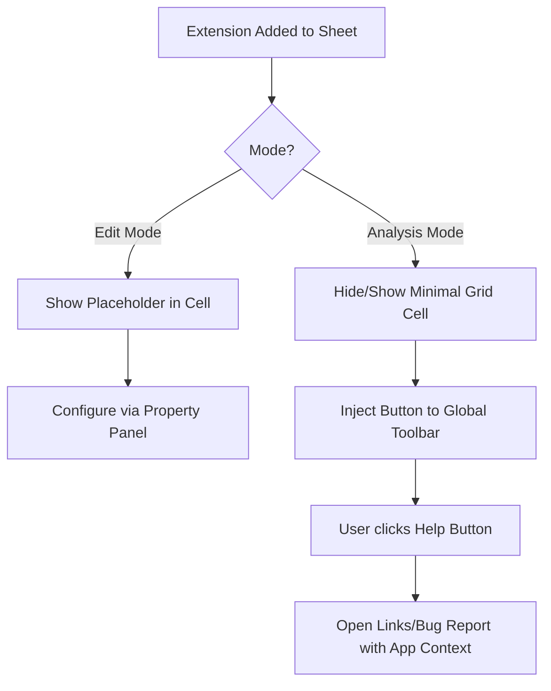

# helpbutton.qs

**helpbutton.qs** is a Qlik Sense extension that injects a configurable help button directly into the Sensse application's toolbar. It provides a seamless way for end-users to access documentation, support resources, or bug reporting forms without cluttering the app sheet area.

## Features

- **Global Toolbar Integration**: In analysis mode, the extension attaches a help button to the main Qlik Sense native toolbar, rather than rendering inside a grid cell.
- **Cross-Platform Support**: Automatically detects and works on both **Qlik Sense SaaS (Cloud)** and **Client-Managed Qlik Sense (Enterprise)** environments, with same features on both platforms.
- **Invisible Footprint**: The extension cell itself can be configured to be invisible to end-users on the sheet, suppressing default interactive grid cell menus and hover menus.
- **Extensive Customization**: Configure colors, icons, languages, and menu actions directly from the Qlik Sense property panel.
- **Context-Aware Links**: Dynamically pass application context (such as App ID, Sheet ID, and user details) to outbound links using template tags.

## Audience

This extension is designed to be added by **Qlik Sense Administrators and Developers** into their Sense applications. Once added to a sheet, it provides a globally accessible help menu for the end-users of that application.

## How It Works

When you drag and drop the extension onto a sheet:

1. In **Edit Mode**: It displays a placeholder within the grid cell. This allows developers to select it and configure its settings via the standard Qlik Sense Property Panel.
2. In **Analysis Mode**: The extension dynamically removes itself from the sheet's visual flow and injects a button into the top application toolbar.

## Installation

1. Download the latest compiled extension `.zip` file from the releases page (or build it from source). Unzip that file to get the `helpbutton-qs.zip` package, which is the actual extension to be imported into Qlik Sense.
2. **Qlik Sense SaaS**: Upload the extension in the Management Console under **Extensions**.
3. **Qlik Sense Client-Managed**: Import the zip file via the Qlik Management Console (QMC) under the **Extensions** section.

## Usage

1. Open your Qlik Sense application in Edit Mode.
2. Drag the **Help Button** extension from the Custom Objects panel onto your sheet.
3. Configure the appearance, links, and behavior in the Property Panel on the right.
4. Switch to Analysis Mode to see the button appear in the top toolbar.

---

For technical documentation and development setup, please see the [developer documentation](docs/DEVELOPMENT.md).
